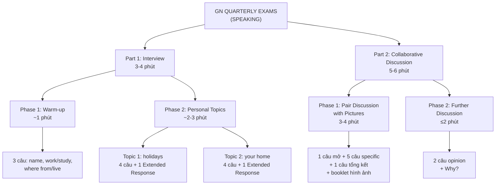

# Triển khai Bộ Đề Thi GN Speaking lên OceanEdu

## Bối cảnh

Cần triển khai format đề thi **GN QUARTERLY EXAMS (SPEAKING)** — tương tự Cambridge PET/KET B1 Preliminary Speaking — lên hệ thống OceanEdu.

Hệ thống hiện đã có sẵn:
- Speaking assessment pipeline (Azure Speech SDK + LLM grading via OpenRouter)
- 3 AI speaking question types: `READ_DISPLAYED_CONTENT`, `SPEAKING_DESCRIBE_IMAGE`, `SPONTANEOUS_QA`
- 7 manual-graded speaking types: `LISTEN_AND_SPEAK_*`
- Exam template system với migration seeding
- Student exam-taking UI với full speaking renderer set

---

## Phân tích Chi tiết Tài liệu Gốc

### Cấu trúc tổng quan



---

### Part 1 — Phase 1: Warm-up (Chi tiết từ tài liệu gốc)

| # | Câu hỏi (Main) | Back-up Prompt | Ghi chú |
|---|---|---|---|
| 1 | What's your name? | *(không có backup)* | Chào hỏi |
| 2 | Do you work or are you a student? | Do you work? Do you study? Are you a student? | Hỏi từng candidate |
| 3 | Where do you come from? *(UK)* / Where do you live? *(non-UK)* | Are you from (Spain, etc.)? / Do you live in … (name of district/town)? | Tuỳ context |

> [!NOTE]
> Trong bài thi gốc, câu hỏi được hỏi cho **cả 2 candidate xen kẽ** (B trước → A sau). Trên hệ thống online (1 student), chỉ cần hỏi **3 câu** cho 1 student.

---

### Part 1 — Phase 2: Personal Topics (Chi tiết từ tài liệu gốc)

**Topic 1: "holidays"**

| # | Target | Câu hỏi (Main) | Back-up Prompt |
|---|---|---|---|
| 1 | A | When do you like going on holiday? | Do you like going on holiday in the summer? |
| 2 | - | How do you usually travel when you go on holiday? | Do you usually travel by car when you go on holiday? |
| 3 | B | Who do you go on holiday with? | Do you go on holiday with your family? |
| 4 | - | Where do you like to eat when you're on holiday? | Do you like to eat at restaurants when you're on holiday? |
| **ER** | **A** | **Please tell me something about your last holiday.** | Where did you go? / What was the weather like? / Did you buy anything special? |

**Topic 2: "your home"**

| # | Target | Câu hỏi (Main) | Back-up Prompt |
|---|---|---|---|
| 1 | B | What kind of building do you live in? | Do you live in a flat? |
| 2 | - | How much time do you spend at home? | Do you spend a lot of time at home? |
| 3 | A | Which room do you like best in your home? | Do you like your bedroom best? |
| 4 | - | What do you enjoy doing at home? | Do you enjoy listening to music at home? |
| **ER** | **B** | **Please tell me something about the different rooms in your home.** | How many rooms are there? / Which is the biggest? / What is your sitting room like? |

> [!NOTE]
> - Mỗi topic: **4 câu ngắn + 1 Extended Response** = 5 câu/topic
> - Extended Response có **3 back-up questions** (dùng khi học sinh bí)
> - Online: tất cả 10 câu hỏi cho 1 student

---

### Part 2 — Phase 1: Pair Discussion with Pictures

**Setup:** Đặt booklet hình ảnh về "different sports" trước mặt

| Bước | Nội dung | Ghi chú |
|---|---|---|
| Intro | "Here are some pictures that show **different sports**." | Hiển thị booklet |
| Open Q | "Do you like these different sports? Say why or why not." | Nói lại 2 lần |
| Free talk | Candidates talk together *(1-2 phút)* | Online: student tự do nói |
| Prompt 1 | "Do you think playing rugby is dangerous?" | + Optional: Why?/Why not? |
| Prompt 2 | "Do you think swimming is healthy?" | + Optional: What do you think? |
| Prompt 3 | "Do you think skiing is expensive?" | |
| Prompt 4 | "Do you think playing tennis is difficult?" | |
| Prompt 5 | "Do you think skateboarding is easy?" | |
| Closing | "Which of these sports do you like best?" | Hỏi cả A và B |

> [!IMPORTANT]
> **Booklet hình ảnh là bắt buộc** — hiển thị các hình ảnh sport khác nhau (rugby, swimming, skiing, tennis, skateboarding). Trên hệ thống online, hiển thị collage/grid hình ảnh.

---

### Part 2 — Phase 2: Further Discussion (Opinion)

| # | Câu hỏi | Follow-up |
|---|---|---|
| 1 | Which is more fun, doing sport alone or playing in a team? | (Why?) |
| 2 | Which do you prefer, watching sport on TV or in a stadium? | (Why?) |

> Mỗi câu hỏi hỏi cả 2 candidate → online = 2 câu cho 1 student.

---

## Tổng hợp Số lượng Câu hỏi (Online / Solo Mode)

| Part | Phase | Số câu | Question Type đề xuất |
|---|---|---|---|
| Part 1 | Phase 1: Warm-up | 3 | `SPONTANEOUS_QA` |
| Part 1 | Phase 2: Topic "holidays" | 5 (4 ngắn + 1 ER) | `SPONTANEOUS_QA` |
| Part 1 | Phase 2: Topic "your home" | 5 (4 ngắn + 1 ER) | `SPONTANEOUS_QA` |
| Part 2 | Phase 1: Discussion w/ Pictures | 7 (1 open + 5 specific + 1 closing) | `GN_SPEAKING_DISCUSSION` **(NEW)** |
| Part 2 | Phase 2: Opinion questions | 2 | `SPONTANEOUS_QA` |
| **TỔNG** | | **22 câu** | |

---

## User Review Required

> [!IMPORTANT]
> ### Quyết định thiết kế cần confirm:
>
> **1. Part 2 Phase 1 — Pair Discussion online?**
> 
> Trong bài thi gốc, 2 candidates "talk together" nhìn hình. Online chỉ có 1 student. Lựa chọn:
> 
> | Option | Mô tả | Complexity | Trải nghiệm |
> |---|---|---|---|
> | **A** | AI đóng vai "bạn cùng thi" (WebRTC Realtime conversational) | 🔴 Cao | Sát bài thi thật nhất |
> | **B** | Solo: Examiner AI hỏi → student trả lời từng câu (như Spontaneous QA nhưng có hình) | 🟢 Thấp | Đủ tốt cho chấm điểm |
> | **C** | 2 student online cùng room, thảo luận qua mic | 🔴 Rất cao | Cần P2P WebRTC |
> 
> **→ Recommendation: Option B cho MVP**
>
> **2. Interactive Communication scoring?**
> 
> | Option | Mô tả |
> |---|---|
> | **A** | Bỏ qua, chỉ chấm Grammar/Vocab + Pronunciation + Global |
> | **B** | LLM approximate từ transcript (detect elaboration, reasons, opinions) + teacher có thể override |
> | **C** | 100% teacher manual |
> 
> **→ Recommendation: Option B**
>
> **3. Extended Response** — Khi student trả lời Extended Response mà bí, có muốn hệ thống tự động hiển thị back-up questions không? Hay teacher phải bấm nút?
> 
> **→ Recommendation: Auto-show back-up questions sau timeout (ví dụ 10 giây im lặng)**
>
> **4. Back-up prompts** — Khi student không hiểu câu hỏi chính, có tự động chuyển sang back-up prompt không?
> 
> **→ Recommendation: Hiển thị cả 2 (main + backup) để student tự đọc; HOẶC auto-show backup sau timeout**
>
> **5. Exam Level**: GN Speaking thuộc level nào? (A1, A2, B1, B2?)

---

## Proposed Changes

### Component 1: Question Type Enum + Migration

#### [MODIFY] [question-type.enum.ts](file:///c:/Users/hoang/Desktop/OceanEdu/oe-exam-api/src/core/questions/enums/question-type.enum.ts)

Thêm 1 question type mới:

```diff
  // Speaking question types
  READ_DISPLAYED_CONTENT = 'READ_DISPLAYED_CONTENT',
  SPEAKING_DESCRIBE_IMAGE = 'SPEAKING_DESCRIBE_IMAGE',
  SPONTANEOUS_QA = 'SPONTANEOUS_QA',
+ GN_SPEAKING_DISCUSSION = 'GN_SPEAKING_DISCUSSION', // Dạng: Thảo luận theo hình ảnh + follow-up prompts (GN Speaking Part 2)
```

#### [NEW] `1776000000000-SeedGNSpeakingExamTemplate.ts`

Migration seed exam template với 4 parts:

```typescript
const parts = [
  {
    id: 1, name: 'Part 1 - Phase 1: Warm-up',
    category: 'SPEAKING', skill: 'SPEAKING',
    points: 3, questionType: 'SPONTANEOUS_QA',
    questionCount: 3, startIndex: 0, endIndex: 2,
    instructions: 'The examiner will ask you some personal questions.',
  },
  {
    id: 2, name: 'Part 1 - Phase 2: Personal Topics',
    category: 'SPEAKING', skill: 'SPEAKING',
    points: 10, questionType: 'SPONTANEOUS_QA',
    questionCount: 10, startIndex: 3, endIndex: 12,
    instructions: 'Answer questions about familiar topics.',
    topicConfig: {
      topics: [
        { name: 'holidays', questionRange: [3, 7] },
        { name: 'your home', questionRange: [8, 12] },
      ]
    }
  },
  {
    id: 3, name: 'Part 2 - Phase 1: Discussion with Pictures',
    category: 'SPEAKING', skill: 'SPEAKING',
    points: 7,
    isGroup: true,
    groupConfig: ['imageUrl', 'topic'],
    groups: [{ number: 1, questionCount: 7 }],
    questionType: 'GN_SPEAKING_DISCUSSION',
    questionCount: 7, startIndex: 13, endIndex: 19,
    instructions: 'Look at the pictures and discuss.',
  },
  {
    id: 4, name: 'Part 2 - Phase 2: Further Discussion',
    category: 'SPEAKING', skill: 'SPEAKING',
    points: 4, questionType: 'SPONTANEOUS_QA',
    questionCount: 2, startIndex: 20, endIndex: 21,
    instructions: 'Answer opinion questions about the topic.',
  },
];
// Total: 22 questions, 4 parts, 24 points
```

---

### Component 2: Backend — Type Definitions + Grading

#### [NEW] Type: `gn-speaking-discussion.ts` (Frontend + Backend)

```typescript
/** Content cho mỗi câu hỏi GN_SPEAKING_DISCUSSION */
export interface GNSpeakingDiscussionContent {
  /** Câu hỏi chính của examiner */
  questionText: string;
  /** Audio URL (TTS hoặc upload) */
  audioUrl?: string;
  /** Input type */
  inputType: 'AUDIO' | 'TEXT';
  /** Back-up prompt (phiên bản đơn giản hơn) */
  backupPrompt?: string;
  /** Optional follow-up prompts (Why?/Why not?/What do you think?) */
  optionalPrompts?: string[];
}

/** Group payload — chứa hình ảnh booklet chung cho nhóm câu hỏi */
export interface GNSpeakingDiscussionGroupPayload {
  /** Chủ đề (e.g. "different sports") */
  topic: string;
  /** URL hình ảnh booklet (collage/grid of images) */
  imageUrl: string;
  /** Instruction mở đầu cho cả nhóm */
  groupInstruction?: string;
}

/** Correct answer */
export interface GNSpeakingDiscussionCorrectAnswer {
  /** Keywords/phrases mong đợi */
  expectedAnswers: string[];
  /** Mẫu trả lời tham khảo */
  sampleAnswer?: string;
}
```

#### [MODIFY] [grading.service.ts](file:///c:/Users/hoang/Desktop/OceanEdu/oe-exam-api/src/modules/student/attempts/services/grading.service.ts)

```diff
  // AI Speaking Assessment
  case QuestionType.READ_DISPLAYED_CONTENT:
  case QuestionType.SPEAKING_DESCRIBE_IMAGE:
  case QuestionType.SPONTANEOUS_QA:
+ case QuestionType.GN_SPEAKING_DISCUSSION:
    return await this.gradeSpeakingAssessment(attemptAnswer, question, promptOverrides);
```

#### [MODIFY] [ai-prompts.constant.ts](file:///c:/Users/hoang/Desktop/OceanEdu/oe-exam-api/src/modules/shared/speaking-assessment/constants/ai-prompts.constant.ts)

Thêm prompt chuyên biệt cho GN Speaking:

```typescript
export const SYSTEM_GN_SPEAKING_ASSESSMENT_PROMPT = `
You are an expert English examiner evaluating a student's speaking in a GN Quarterly Speaking exam.

You will evaluate based on 4 criteria:

1. **Grammar and Vocabulary** (weight 30%):
   - Is grammar correct? Focus on: third-person 's', pluralization, be verbs, tense consistency.
   - Is vocabulary sufficient and appropriate for the topic?
   
2. **Pronunciation** (scored by Azure - external):
   - Referenced in feedback only. Use provided Azure scores.

3. **Interactive Communication** (weight 20%):
   - Does the student respond appropriately and on-topic?
   - Do they elaborate beyond one-word answers?
   - Do they give reasons/opinions when asked "Why?"
   - Do they use discourse markers (Well, I think, Actually, Because...)?
   
4. **Global Achievement** (weight 20%):
   - Overall effectiveness of communication
   - Is the response natural, coherent, and sufficiently developed?
   - Can a listener understand the student's message?

Scoring Guidelines:
- Be encouraging for young learners (ages 8-15)
- Reward elaboration and opinion-giving
- Penalize one-word answers or completely off-topic responses
- Consider the question context (warm-up vs extended response vs discussion)
`;
```

#### [NEW] Mở rộng LLM output schema cho GN Speaking

```typescript
export const FIXED_GN_SCORING_RULES = `
[OUTPUT FORMAT — MANDATORY]
You MUST output a valid JSON object:

{
  "contentScore": number,           // 0-100: relevance and completeness of answer
  "grammarScore": number,           // 0-100: grammatical accuracy and vocabulary range  
  "interactiveScore": number,       // 0-100: conversational engagement, elaboration, opinion-giving
  "globalScore": number,            // 0-100: overall communication effectiveness
  "feedback": "string"              // 2-3 sentences, encouraging, covering all criteria
}

[SCORING RULES]
- If "Recognized Text" is empty or random noise, set ALL scores to 0.
- interactiveScore: Give high scores (80+) if student elaborates, gives reasons, uses discourse markers.
  Give low scores (<50) if student only says one word or doesn't address the question.
- globalScore: Holistic assessment. A student who communicates their point clearly despite some errors
  should score higher than a student who is grammatically perfect but says nothing meaningful.
- Do NOT output any conversational text, ONLY output the raw JSON object.
`;
```

#### [MODIFY] `LlmAssessmentResult` DTO

```typescript
export interface LlmAssessmentResult {
  contentScore: number;
  grammarScore: number;
  interactiveScore?: number;   // NEW — for GN Speaking
  globalScore?: number;        // NEW — for GN Speaking
  feedback: string;
}
```

#### [MODIFY] Scoring formula in `gradeSpeakingAssessment`

Cho `GN_SPEAKING_DISCUSSION`:

```
Azure Component (30%):
  = (Accuracy×0.30 + Fluency×0.25 + Prosody×0.20 + Completeness×0.25) × 0.30

LLM Component (70%):
  grammarVocab = grammarScore × 0.30
  interactive  = interactiveScore × 0.20  
  global       = globalScore × 0.20
  = (grammarVocab + interactive + global + contentScore×0.30) × 0.70

Final Score = Azure Component + LLM Component
```

Cho `SPONTANEOUS_QA` (Part 1 + Part 2 Phase 2) — giữ nguyên formula hiện tại:
```
50% Azure + 50% LLM (70% content + 30% grammar)
```

---

### Component 3: Frontend — Admin Creator

#### [NEW] `GNSpeakingDiscussionCreator.tsx`

UI tạo câu hỏi cho admin:
- **Group level**: Upload hình booklet + nhập topic
- **Per question**: Nhập question text + backup prompt + optional prompts + expected answers
- Nút TTS preview
- Hỗ trợ audio upload

#### [MODIFY] [ExamCreator.tsx](file:///c:/Users/hoang/Desktop/OceanEdu/oe-exam-fe/components/features/exam/ExamCreator.tsx)

Thêm route cho `GN_SPEAKING_DISCUSSION` → `GNSpeakingDiscussionCreator`.

---

### Component 4: Frontend — Student Exam Renderer

#### [NEW] `SpeakingGNDiscussionRenderer.tsx`

Layout cho Part 2 Phase 1:

```
┌──────────────────────────────────────────────┐
│  Header: Part 2 - Discussion with Pictures   │
├──────────────────────────────────────────────┤
│                                              │
│  ┌────────────────────────────────────────┐  │
│  │         BOOKLET IMAGE (Grid)           │  │
│  │  🏉 Rugby  🏊 Swimming  ⛷️ Skiing     │  │
│  │  🎾 Tennis  🛹 Skateboarding           │  │
│  └────────────────────────────────────────┘  │
│                                              │
│  ┌────────────────────────────────────────┐  │
│  │ 🔊 "Do you think swimming is healthy?" │  │
│  │                                        │  │
│  │ 💡 Backup: Why? / Why not?             │  │
│  └────────────────────────────────────────┘  │
│                                              │
│  ┌────────────────────────────────────────┐  │
│  │          🎤 Record Answer              │  │
│  │    [⏺ Start] [⏹ Stop] [▶ Preview]     │  │
│  └────────────────────────────────────────┘  │
│                                              │
│  ◀ Previous    [3/7]    Next ▶               │
└──────────────────────────────────────────────┘
```

- Hình booklet luôn hiển thị phía trên (fixed)
- Câu hỏi examiner hiện ở giữa (có audio playback)
- Mic button và recording preview ở dưới
- Back-up prompt hiện dưới câu hỏi chính (hoặc auto-show sau timeout)

Pattern: Kế thừa từ `SpeakingDescribeImageRenderer` + `SpeakingSpontaneousQARenderer`

#### [MODIFY] [SpeakingQuestionRenderer.tsx](file:///c:/Users/hoang/Desktop/OceanEdu/oe-exam-fe/app/(exam-fullscreen)/student/exams/[roomId]/take/components/speaking/renderers/SpeakingQuestionRenderer.tsx)

```diff
+ case 'GN_SPEAKING_DISCUSSION':
+   return <SpeakingGNDiscussionRenderer {...props} />;
```

#### [MODIFY] Renderers index

Export mới trong `renderers/index.ts`.

---

## Ví dụ Data JSON cho 1 đề thi GN Speaking hoàn chỉnh

```json
{
  "templateTitle": "GN Quarterly Speaking Test 4",
  "totalQuestions": 22,
  "parts": [
    {
      "partName": "Part 1 Phase 1 - Warm-up",
      "questions": [
        {
          "questionType": "SPONTANEOUS_QA",
          "content": {
            "inputType": "TEXT",
            "questionText": "What's your name?"
          },
          "correctAnswer": { "sampleAnswer": "My name is ..." },
          "points": 1
        },
        {
          "questionType": "SPONTANEOUS_QA",
          "content": {
            "inputType": "TEXT",
            "questionText": "Do you work or are you a student?",
            "backupPrompt": "Do you work? Do you study? Are you a student?"
          },
          "correctAnswer": { "sampleAnswer": "I am a student. I study at ..." },
          "points": 1
        },
        {
          "questionType": "SPONTANEOUS_QA",
          "content": {
            "inputType": "TEXT",
            "questionText": "Where do you live?",
            "backupPrompt": "Do you live in ... (name of district / town)?"
          },
          "correctAnswer": { "sampleAnswer": "I live in ..." },
          "points": 1
        }
      ]
    },
    {
      "partName": "Part 2 Phase 1 - Discussion with Pictures",
      "groupPayload": {
        "topic": "different sports",
        "imageUrl": "speaking/gn-test-4/sports-booklet.jpg"
      },
      "questions": [
        {
          "questionType": "GN_SPEAKING_DISCUSSION",
          "content": {
            "inputType": "TEXT",
            "questionText": "Do you like these different sports? Say why or why not."
          },
          "correctAnswer": {
            "expectedAnswers": ["I like...", "because...", "I don't like..."],
            "sampleAnswer": "I like swimming because it's fun and healthy. I don't like rugby because it's dangerous."
          },
          "points": 1
        },
        {
          "questionType": "GN_SPEAKING_DISCUSSION",
          "content": {
            "inputType": "TEXT",
            "questionText": "Do you think playing rugby is dangerous?",
            "optionalPrompts": ["Why?", "Why not?", "What do you think?"]
          },
          "correctAnswer": {
            "expectedAnswers": ["dangerous", "hurt", "injury", "safe", "exciting"],
            "sampleAnswer": "Yes, I think rugby is dangerous because you can get hurt."
          },
          "points": 1
        }
      ]
    }
  ]
}
```

---

## Open Questions

> [!IMPORTANT]
> 1. **Part 2 Pair Discussion online** — Recommendation: **Option B (solo response)** cho MVP
> 2. **Interactive Communication scoring** — Recommendation: **Option B (LLM approximate)**
> 3. **Extended Response back-up questions** — Auto-show sau timeout hay hiển thị sẵn?
> 4. **Back-up prompts** — Hiển thị cùng lúc hay chỉ khi timeout?
> 5. **Exam Level**: GN Speaking thuộc level nào?
> 6. **Có cần field `backupPrompt` mới** trong `SpontaneousQAContent` type hiện tại không? Hiện tại `SPONTANEOUS_QA` chưa có field backup prompt.

---

## Verification Plan

### Automated Tests
1. Migration chạy thành công: `npm run migration:run`
2. Build pass: `npm run build` (cả FE + BE)
3. Playground test: `POST /speaking-assessment/playground/test-full-pipeline` với `questionType: GN_SPEAKING_DISCUSSION`

### Manual Verification
1. Admin tạo đề GN Speaking → verify template 4 parts, 22 câu
2. Admin nhập câu hỏi → verify data lưu đúng (backup prompts, group images)
3. Student vào thi Part 1 → verify SPONTANEOUS_QA renderer hoạt động
4. Student vào thi Part 2 Phase 1 → verify booklet image + discussion renderer
5. Ghi âm trả lời → verify AI grading trả về đủ 4 tiêu chí
6. Teacher review → verify hiển thị scores + feedback đầy đủ
