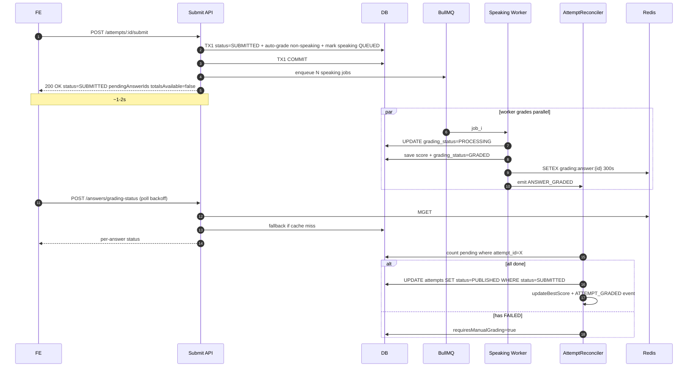

# Submit Attempt — Fire-and-Forget (Backend `oe-exam-api`)

> **Status**: Draft v3 — reviewed & updated from v2
> **Repo**: `oe-exam-api` (NestJS + TypeORM + BullMQ + Redis)
> **Goal**: `POST /api/v1/student/attempts/:id/submit` p95 **< 2s** (hiện tại 10–60s) bằng cách bỏ `Promise.all` chờ speaking grading trong request, để worker chấm bất đồng bộ và FE poll trạng thái.

---

## 0. Code review — current state (đã đọc thực tế)

| File | Hiện trạng | Vấn đề |
|---|---|---|
| [`AttemptsService.submitAttempt()`](oe-exam-api/src/modules/student/attempts/services/attempts.service.ts:478) | Wrap toàn bộ flow trong 1 transaction → set `SUBMITTED` → gọi [`gradeAndPublishAttempt()`](oe-exam-api/src/modules/student/attempts/services/attempts.service.ts:555) → commit | TX dài, giữ connection cả khi đợi AI |
| [`GradingService.gradeAttempt()`](oe-exam-api/src/modules/student/attempts/services/grading/grading.service.ts:69) | Phase A load → Phase B sync grade → Phase C `Promise.all` `waitForSpeakingGrade` (timeout `SPEAKING_WAIT_ON_SUBMIT_MS`) → Phase D batch save | Chờ tới 10s/answer; nếu timeout đánh dấu `requiresManualGrading=true` sai |
| [`SpeakingGradingProcessor`](oe-exam-api/src/modules/student/attempts/processors/speaking-grading.processor.ts:34) | Worker đã emit `SPEAKING_GRADING_EVENTS.ANSWER_GRADED` sau khi save | Chưa có FAILED event, chưa update `grading_status` (chưa có cột) |
| [`AttemptAnswer`](oe-exam-api/src/modules/student/attempts/entities/attempt-answer.entity.ts:16) | Có `score`, `gradedAt`, `audioKey` | **Thiếu** `gradingStatus`, `gradingJobId`, `gradingAttempts`, `gradingError`, `gradingStartedAt` |
| [`speaking-grading.events.ts`](oe-exam-api/src/modules/student/attempts/events/speaking-grading.events.ts:1) | Chỉ có `ANSWER_GRADED` | Cần thêm `ANSWER_FAILED`, `ANSWER_PROCESSING_STARTED` |
| [`attempts.module.ts`](oe-exam-api/src/modules/student/attempts/attempts.module.ts:30) | Đã đăng ký Bull queue, processor, queue service | **Chưa** đăng ký `AttemptReconcilerService`, `GradingStatusService`, janitor cron |
| [`attempts.controller.ts`](oe-exam-api/src/modules/student/attempts/controllers/attempts.controller.ts:321) submit endpoint | Trả về `attempt` entity raw | Cần trả `pendingAnswerIds` để FE biết poll |
| [`SpeakingGradingQueueService.enqueue`](oe-exam-api/src/modules/student/attempts/services/speaking-grading-queue.service.ts:25) | Đã có: `attempts:3, backoff:exponential delay:2000, removeOnComplete:true, removeOnFail:false` | OK — chỉ cần đổi `removeOnComplete` thành `{ age: 86400, count: 1000 }` để giữ history phục vụ debug + janitor; trả `jobId` để lưu vào `grading_job_id` |
| [`RealtimeGradingController.grade-single`](oe-exam-api/src/modules/student/attempts/controllers/realtime-grading.controller.ts:54) | Đã enqueue job ngay khi FE thu âm xong (FE [`useSpeakingRecorder`](oe-exam-fe/app/(exam-fullscreen)/student/exams/[roomId]/take/hooks/useSpeakingRecorder.ts:217)) | **Optimization quan trọng:** lúc submit phần lớn speaking answers đã `GRADED` rồi → `pendingSpeakingAnswers` thường rất nhỏ; `submitAttempt` chỉ cần enqueue **những câu chưa có `gradedAt`** |
| [`StudentBestScoreService.updateBestScore`](oe-exam-api/src/modules/student/attempts/services/student-best-score.service.ts:32) | Early return nếu `status !== PUBLISHED` | Reconciler **bắt buộc** set status PUBLISHED **trước** khi gọi (đã đúng trong plan) |
| [`Attempt`](oe-exam-api/src/modules/student/attempts/entities/attempt.entity.ts:23) entity | Có sẵn `requiresManualGrading`, `submittedAt`, `totalScore`, `sectionScores` | OK — không cần migration cho `attempts` table |
| [`gradeAndPublishAttempt()`](oe-exam-api/src/modules/student/attempts/services/attempts.service.ts:555) | L603-604: `status = GRADED` rồi ngay `status = PUBLISHED` | **🐛 BUG**: double-assignment — `GRADED` bị ghi đè ngay bởi `PUBLISHED`. Tương tự ở `checkAndPublishIfComplete` L803-805 |
| [`getAttemptReview()`](oe-exam-api/src/modules/student/attempts/services/attempts.service.ts:380) | Guard: `status !== PUBLISHED` → throw 403 | **🚧 BLOCKER cho fire-and-forget**: FE push sang result page khi status còn `SUBMITTED` → bị 403 |
| [`checkAndPublishIfComplete()`](oe-exam-api/src/modules/student/attempts/services/attempts.service.ts:770) | Teacher grading flow gọi method này để auto-publish | Cần refactor hoặc delegate sang reconciler để tránh conflict |

⇒ Plan gốc khớp ~80% thực tế; những điểm khác biệt và bugs đã ghi chú ở trên.

### 0.1 Insight bổ sung

**Realtime grading đã chạy sẵn trong lúc thi** (`RealtimeGradingController.grade-single`):
- Khi học sinh thu âm xong 1 câu speaking, FE [`useSpeakingRecorder`](oe-exam-fe/app/(exam-fullscreen)/student/exams/[roomId]/take/hooks/useSpeakingRecorder.ts:217) tự gọi `realtimeGradeSingle` (fire-and-forget) → enqueue job ngay.
- Đến lúc submit, đa phần answers đã `score !== null` và `gradedAt` đã set.
- ⇒ **Vector tấn công chính của plan này là worst-case**: học sinh thu âm sát giờ submit, hoặc realtime grading job bị slow/fail.
- Trong `classifyAndAutoGrade()`: chỉ enqueue speaking answer nếu `audioKey != null && score == null && gradingStatus NOT IN (QUEUED|PROCESSING|GRADED)` — tránh duplicate job.

### 0.2 Known bugs cần fix trong scope này

1. **Double-assignment `GRADED`→`PUBLISHED`** (L603-604, L803-805): `attempt.status = AttemptStatus.GRADED` bị ghi đè ngay bởi `attempt.status = AttemptStatus.PUBLISHED` ở dòng kế tiếp. Reconciler mới cần phân biệt rõ 2 status này → **fix trong Phase 5**.
2. **`getAttemptReview()` require PUBLISHED**: Sau fire-and-forget, attempt status = `SUBMITTED` khi FE navigate sang result page → BE throw 403. **Cần nới guard** → **fix trong Phase 4** (xem 3.6.1).

---

## 1. Target architecture



---

## 2. Schema migration

### 2.1 Enum

`oe-exam-api/src/modules/student/attempts/enums/answer-grading-status.enum.ts`

```ts
export enum AnswerGradingStatus {
  PENDING = 'PENDING',           // chưa nộp/chưa có audio
  AUTO_GRADED = 'AUTO_GRADED',   // MCQ/Reading/Listening — sync tại submit
  QUEUED = 'QUEUED',             // đã enqueue job speaking
  PROCESSING = 'PROCESSING',     // worker đang chạy
  GRADED = 'GRADED',             // AI chấm xong
  FAILED = 'FAILED',             // AI fail hết retry → manual
  MANUAL_REVIEW = 'MANUAL_REVIEW',
  COMPLETED = 'COMPLETED',       // teacher chấm xong
}
```

Re-export trong [`enums/index.ts`](oe-exam-api/src/modules/student/attempts/enums/index.ts).

### 2.2 Migration `AddGradingStatusToAttemptAnswers`

Thêm `grading_status`, `grading_attempts`, `grading_job_id`, `grading_error`, `grading_started_at` + index `(attempt_id, grading_status)` + backfill.

### 2.3 Update entity [`AttemptAnswer`](oe-exam-api/src/modules/student/attempts/entities/attempt-answer.entity.ts:16)

Thêm 5 cột tương ứng + decorator `@Index(['attemptId', 'gradingStatus'])`.

---

## 3. Backend tasks

### 3.1 Refactor [`submitAttempt()`](oe-exam-api/src/modules/student/attempts/services/attempts.service.ts:478)

- Bỏ `gradeAndPublishAttempt()` khỏi đường nóng.
- TX1 (ngắn): pessimistic lock attempt → set `SUBMITTED` + `submittedAt` → gọi `gradingService.classifyAndAutoGrade()` (mới — chỉ phần sync) → batch save → commit.
- Sau TX1: enqueue Bull job cho từng speaking answer (out-of-band), update `gradingJobId`.
- Emit `ROOM_STATISTICS_EVENTS.ATTEMPT_SUBMITTED`.
- Trả về `{ attempt, pendingAnswerIds[], autoGradedCount, manualReviewAnswerIds[] }`.
- **Fix bug**: xóa double-assignment `GRADED`→`PUBLISHED` (L603-604). Khi fire-and-forget: status giữ `SUBMITTED` nếu có pending; reconciler sẽ promote sau.

### 3.2 Tách [`GradingService`](oe-exam-api/src/modules/student/attempts/services/grading/grading.service.ts:69)

Tạo method mới `classifyAndAutoGrade(attempt, manager)`:
- Load answers + questions (giống Phase A/B hiện tại).
- Sync grade Reading/Listening/objective → `gradingStatus = AUTO_GRADED`.
- Speaking có audio → `gradingStatus = QUEUED`, không chờ.
- Writing → `gradingStatus = MANUAL_REVIEW`, set `requiresManualGrading=true`.
- Return `{ autoGradedAnswers, pendingSpeakingAnswers, manualAnswers, partialTotalScore, sectionScores }`.

Giữ `gradeAttempt()` cũ dưới feature flag `SUBMIT_FAST_RETURN=false` để rollback.

### 3.3 [`SpeakingGradingProcessor`](oe-exam-api/src/modules/student/attempts/processors/speaking-grading.processor.ts:34) updates

- Đầu hàm: `UPDATE grading_status=PROCESSING, grading_started_at=NOW()`.
- Sau save: `grading_status=GRADED`, write Redis `grading:answer:{id}` TTL 300s, emit `ANSWER_GRADED`.
- `OnWorkerEvent('failed')`: nếu `attemptsMade >= attempts` → set `FAILED`, `grading_error=err.message`, emit `ANSWER_FAILED`.
- Bull job options: `attempts: 3`, `backoff: { type: 'exponential', delay: 5000 }`, `removeOnComplete: { age: 86400, count: 1000 }`, `removeOnFail: false`.

### 3.4 New events

`oe-exam-api/src/modules/student/attempts/events/speaking-grading.events.ts` — bổ sung:

```ts
export const SPEAKING_GRADING_EVENTS = {
  ANSWER_PROCESSING_STARTED: 'speaking.answer.processing',
  ANSWER_GRADED: 'speaking.answer.graded',
  ANSWER_FAILED: 'speaking.answer.failed',
} as const;
```

### 3.5 New `AttemptReconcilerService`

`oe-exam-api/src/modules/student/attempts/services/attempt-reconciler.service.ts`

- `@OnEvent(ANSWER_GRADED)` + `@OnEvent(ANSWER_FAILED)` → `tryPromote(attemptId)`.
- Count pending (`QUEUED|PROCESSING`); nếu 0 → recompute totals → conditional `UPDATE attempts SET status='PUBLISHED' WHERE id=:id AND status='SUBMITTED' RETURNING *` (idempotent).
- **Race condition protection**: nếu `affected === 0` → another reconciler instance đã promote → skip side-effects. Dùng `RETURNING *` để lấy row nếu success.
- Nếu có `FAILED|MANUAL_REVIEW` → `requiresManualGrading=true`, status = `GRADED` (chờ teacher), emit `ATTEMPT_NEEDS_MANUAL`.
- Nếu PUBLISHED → gọi [`StudentBestScoreService.updateBestScore`](oe-exam-api/src/modules/student/attempts/services/student-best-score.service.ts) + emit `ROOM_STATISTICS_EVENTS.ATTEMPT_GRADED` (pass đủ payload: `examRoomId`, `studentId`, `totalScore`, `maxScore`).

### 3.6 New `GradingStatusService` + endpoints

`oe-exam-api/src/modules/student/attempts/services/grading-status.service.ts` — Redis MGET → DB fallback (TTL 300s terminal, 2s non-terminal).

> **Lưu ý Redis dependency**: Hiện `attempts.module.ts` chỉ import BullMQ (dùng Redis ngầm). Cần import `@nestjs-modules/ioredis` riêng cho cache reads. Verify `AppModule` đã register `RedisModule` chưa, nếu chưa thì thêm.

Trong [`AttemptsController`](oe-exam-api/src/modules/student/attempts/controllers/attempts.controller.ts) thêm:

- `GET /api/v1/student/attempts/:id/grading-summary` → `{ attemptStatus, totalAnswers, gradedCount, pendingAnswerIds[], failedAnswerIds[], manualReviewAnswerIds[] }`
- `POST /api/v1/student/attempts/:id/answers/grading-status` body `{ answerIds: string[] }` (max 50 UUID) → `{ answers[], allCompleted }`
- Throttle: `@Throttle({ default: { limit: 30, ttl: 60_000 } })`
- Ownership guard: verify attempt thuộc về `session.user.id`.

### 3.6.1 Nới guard `getAttemptReview()` cho fire-and-forget

Hiện tại [`getAttemptReview()`](oe-exam-api/src/modules/student/attempts/services/attempts.service.ts:380) throw 403 nếu `status !== PUBLISHED`. Sau fire-and-forget, FE navigate sang result page khi status còn `SUBMITTED`.

**Giải pháp**: cho phép access khi `status IN (SUBMITTED, GRADED, PUBLISHED)`:
- `SUBMITTED` / `GRADED`: trả partial data + flag `{ partial: true, gradingInProgress: true }` để FE biết cần poll.
- `PUBLISHED`: trả full data như hiện tại, `{ partial: false }`.
- Giữ reject `IN_PROGRESS` (chưa nộp bài → không cho xem).

### 3.6.2 Refactor `checkAndPublishIfComplete()`

[`checkAndPublishIfComplete()`](oe-exam-api/src/modules/student/attempts/services/attempts.service.ts:770) được teacher grading module gọi sau khi chấm essay.

- **Option A (đề xuất)**: Delegate sang reconciler — teacher grading flow emit `ANSWER_GRADED` event → reconciler `tryPromote()` xử lý thống nhất.
- **Option B**: Giữ method nhưng update logic dùng `gradingStatus` thay vì `score IS NULL`, và fix double-assignment bug L803-805.

### 3.7 Janitor cron

`oe-exam-api/src/modules/student/attempts/jobs/grading-janitor.job.ts` — `@Cron('*/2 * * * *')`:
- Tìm answers `QUEUED|PROCESSING` với `grading_started_at < NOW()-5min` → mark `FAILED`, emit `ANSWER_FAILED` (reconciler sẽ promote attempt).
- **Race condition protection**: Janitor phải dùng conditional UPDATE để tránh conflict với worker đang process:
  ```sql
  UPDATE attempt_answers
  SET grading_status = 'FAILED', grading_error = 'Timeout by janitor'
  WHERE id = :id AND grading_status IN ('QUEUED', 'PROCESSING')
    AND grading_started_at < NOW() - INTERVAL '5 minutes'
  ```
  Nếu worker đã set `GRADED` trước janitor → `affected = 0` → janitor skip.
- Cho answers `QUEUED` chưa có `grading_started_at`: dùng `created_at < NOW()-5min` làm fallback.

### 3.8 Module registration

[`attempts.module.ts`](oe-exam-api/src/modules/student/attempts/attempts.module.ts:30) — providers thêm `AttemptReconcilerService`, `GradingStatusService`, `GradingJanitorJob`. Import `ScheduleModule.forRoot()` ở `AppModule` nếu chưa có. Inject `@nestjs-modules/ioredis` cho cache.

### 3.9 Feature flag

`SUBMIT_FAST_RETURN` env (default `false`) đọc qua `ConfigService`. Khi `false`: chạy code path cũ. Khi `true`: chạy fire-and-forget. Sau 1–2 tuần stable thì xóa nhánh cũ.

### 3.10 Side-effect realignment

| Side-effect | Cũ (trong `submitAttempt`) | Mới (trong `AttemptReconciler.tryPromote`) |
|---|---|---|
| `updateBestScore` | TX submit | Khi status → PUBLISHED |
| `ROOM_STATISTICS_EVENTS.ATTEMPT_GRADED` | sau submit | sau reconciler promote |
| `requiresManualGrading` | tính từ `gradeAttempt` | tính lại từ count `FAILED|MANUAL_REVIEW` |

---

## 4. Observability

- Metrics: `submit_attempt_duration_ms` (target p95 < 2s), `speaking_grading_duration_ms`, `speaking_grading_failures_total{reason}`, `grading_pending_answers` gauge, `grading_janitor_recovered_total`.
- Logs có correlation `attemptId, answerId, gradingJobId`.
- Alerts: janitor recover > 10/5min, p95 submit > 5s, BullMQ DLQ > 100.

---

## 5. Risks & mitigations

| Risk | Mitigation |
|---|---|
| FE chưa update polling → kết quả không hiển thị | Reconciler vẫn cập nhật `attempt.status` đúng → FE cũ vẫn poll `getById` được; thêm `ATTEMPT_GRADED` event để invalidate cache |
| Bull queue down | Health check + janitor fallback → manual sau 5 phút |
| Reconciler double-promote | Conditional `WHERE status='SUBMITTED' RETURNING *`; check `affected===0` → skip side-effects |
| Janitor vs worker race | Janitor dùng conditional UPDATE `WHERE grading_status IN ('QUEUED','PROCESSING')` — nếu worker đã GRADED thì affected=0 |
| Migration table lớn | Backfill bằng batch UPDATE `WHERE id IN (...)` LIMIT 10k |
| In-flight attempts khi deploy | Janitor + reconciler tự pick up sau 5 phút |
| Cache stale | Worker write DB trước, cache sau; non-terminal TTL = 2s |
| `getAttemptReview` 403 khi SUBMITTED | Nới guard cho SUBMITTED/GRADED, trả `partial: true` flag (xem 3.6.1) |

---

## 6. Phased checklist (BE)

### Phase 1 — AttemptReconciler (in progress per plan gốc)
- [x] `SPEAKING_GRADING_EVENTS.ANSWER_GRADED` event file
- [x] Worker emit event sau save
- [ ] `AttemptReconcilerService` listener (conditional UPDATE)
- [ ] Đăng ký trong [`attempts.module.ts`](oe-exam-api/src/modules/student/attempts/attempts.module.ts:30)
- [ ] Unit tests race conditions (2 events đồng thời, idempotency)

### Phase 2 — Schema migration
- [ ] Tạo enum `AnswerGradingStatus`
- [ ] Migration `AddGradingStatusToAttemptAnswers` + index + backfill
- [ ] Update [`AttemptAnswer`](oe-exam-api/src/modules/student/attempts/entities/attempt-answer.entity.ts:16) entity
- [ ] Test migration up/down trên copy DB

### Phase 3 — Worker + reconciler dùng grading_status
- [ ] Worker chuyển trạng thái QUEUED → PROCESSING → GRADED|FAILED
- [ ] Worker write Redis cache + emit `ANSWER_FAILED`
- [ ] Bull job retry policy
- [ ] Reconciler query theo `grading_status` thay vì `score IS NULL`
- [ ] Janitor cron (`@nestjs/schedule`)

### Phase 4 — Endpoints poll + guard relaxation
- [ ] `GradingStatusService` (Redis MGET + DB fallback)
- [ ] Verify + import `@nestjs-modules/ioredis` RedisModule
- [ ] `GET /grading-summary` + DTO + Swagger
- [ ] `POST /answers/grading-status` + DTO + throttle + ownership guard
- [ ] Nới `getAttemptReview()` guard: accept `SUBMITTED|GRADED|PUBLISHED`, trả `partial` flag
- [ ] E2E tests cho 2 endpoint mới + partial review

### Phase 5 — Fire-and-forget submit
- [ ] `GradingService.classifyAndAutoGrade()` (sync only)
- [ ] Refactor `submitAttempt()` (split TX, enqueue ngoài TX)
- [ ] Fix double-assignment bug `GRADED`→`PUBLISHED` (L603-604, L803-805)
- [ ] Cập nhật response DTO (`SubmitAttemptResponseDto` thêm `pendingAnswerIds`, `autoGradedCount`, `manualReviewAnswerIds`)
- [ ] Move side-effects sang reconciler
- [ ] Refactor `checkAndPublishIfComplete()` → delegate sang reconciler hoặc update logic dùng `gradingStatus`
- [ ] Feature flag `SUBMIT_FAST_RETURN`
- [ ] Update Swagger response example

### Phase 6 — Observability
- [ ] Prometheus histograms + counters + gauges
- [ ] Structured logs với correlation id
- [ ] Alerts Grafana

### Phase 7 — Rollout
- [ ] Deploy schema migration (flag off)
- [ ] Bật flag staging → smoke E2E + chạy 50 submit speaking
- [ ] Canary 1 contest → monitor metrics 24h
- [ ] 10% → 50% → 100% production
- [ ] Xóa code path cũ + flag

---

## 7. Open questions (BE) — Đã resolve

1. ~~Writing essay: có cần `grading_status=MANUAL_REVIEW` hay chỉ cờ `requiresManualGrading`?~~ → **Dùng `MANUAL_REVIEW`** cho consistency. Hiện tại writing trả `score: null` → map sang `MANUAL_REVIEW` hợp lý.
2. ~~Re-grade khi teacher sửa: cần `AttemptRescoreService` riêng~~ → **Out of scope** — giữ nguyên.
3. ~~Per-section best score (TOEIC L/R)~~ → `updateBestScore` hiện handle attempt-level. Section gating nếu cần → **scope riêng**.
4. ~~Realtime grade single skip enqueue~~ → **Must have**. Check `gradedAt != null || score != null` trước khi enqueue → tránh duplicate Azure calls. Đã include trong logic `classifyAndAutoGrade()` (section 0.1).

---

## 8. References

- [`AttemptsService.submitAttempt()`](oe-exam-api/src/modules/student/attempts/services/attempts.service.ts:478)
- [`AttemptsService.gradeAndPublishAttempt()`](oe-exam-api/src/modules/student/attempts/services/attempts.service.ts:555)
- [`GradingService.gradeAttempt()`](oe-exam-api/src/modules/student/attempts/services/grading/grading.service.ts:69)
- [`SpeakingGradingProcessor`](oe-exam-api/src/modules/student/attempts/processors/speaking-grading.processor.ts:34)
- [`AttemptAnswer`](oe-exam-api/src/modules/student/attempts/entities/attempt-answer.entity.ts:16)
- [`speaking-grading.events.ts`](oe-exam-api/src/modules/student/attempts/events/speaking-grading.events.ts:1)
- [`speaking-grading.constants.ts`](oe-exam-api/src/modules/student/attempts/constants/speaking-grading.constants.ts:1)
- [`AttemptsController.submitAttempt`](oe-exam-api/src/modules/student/attempts/controllers/attempts.controller.ts:321)
- Cross-ref FE plan: [`plans/submit-attempt-fire-and-forget-fe.md`](plans/submit-attempt-fire-and-forget-fe.md)
