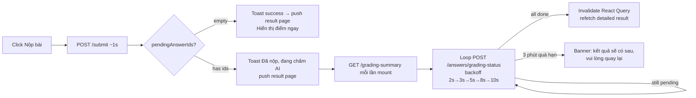

# Submit Attempt — Fire-and-Forget (Frontend `oe-exam-fe`)

> **Status**: Draft v3 — reviewed & updated from v2
> **Repo**: `oe-exam-fe` (Next.js App Router + React Query + Zustand)
> **Goal**: Submit response < 2s, hiển thị progress chấm AI cho từng câu speaking trên trang result mà không block UI.

---

## 0. Code review — current state (đã đọc thực tế)

| File | Hiện trạng | Vấn đề |
|---|---|---|
| [`attemptsApi.submit`](oe-exam-fe/lib/api/student/attempts.api.ts:84) | `POST .../submit` → trả `SubmitAttemptResponse = { attempt }` | Không nhận `pendingAnswerIds` |
| [`SubmitAttemptResponse`](oe-exam-fe/types/student.types.ts:58) | `{ attempt }` đơn giản | Cần thêm `pendingAnswerIds`, `autoGradedCount`, `manualReviewAnswerIds` |
| [`handleSubmit`](oe-exam-fe/app/(exam-fullscreen)/student/exams/[roomId]/take/page.tsx:370) | `await attemptsApi.submit()` → toast → router.push result | UX hiện chỉ chờ HTTP; nếu 60s sẽ treo |
| [`useDetailedResult`](oe-exam-fe/lib/api/student/hooks/use-results.ts:23) | Fetch detail + attempt 1 lần, staleTime 5 phút | Không refetch khi grading xong |
| [`speaking-review/page.tsx`](oe-exam-fe/app/student/results/[attemptId]/speaking-review/page.tsx) | Có flag `isPendingGrading` → banner "Đang chờ chấm" | Hiển thị tĩnh, không tự refresh khi worker chấm xong |
| [`review/page.tsx`](oe-exam-fe/app/student/results/[attemptId]/review/page.tsx) | Tương tự, dùng `detailData.isPendingGrading` | Không có UI per-answer "đang chấm" / "đã chấm" |
| [`AttemptStatus`](oe-exam-fe/types/student.types.ts:3) | `IN_PROGRESS / SUBMITTED / GRADED / PUBLISHED` | OK; cần thêm enum `AnswerGradingStatus` cho FE |

⇒ FE chưa có cơ chế poll / cập nhật real-time → cần thêm.

> **🚧 BLOCKER**: Hiện tại `getAttemptReview()` (BE) throw 403 nếu `status !== PUBLISHED`. Sau fire-and-forget, attempt status = `SUBMITTED` khi FE push sang result page. **BE plan v3 đã bổ sung giải pháp** (section 3.6.1): nới guard cho `SUBMITTED|GRADED|PUBLISHED`, trả `{ partial: true }` flag. FE cần handle flag này.

### 0.1 Insight bổ sung (review lần 2)

- **Realtime grading đã chạy trong lúc thi**: [`useSpeakingRecorder.ts:217`](oe-exam-fe/app/(exam-fullscreen)/student/exams/[roomId]/take/hooks/useSpeakingRecorder.ts:217) đã gọi `attemptsApi.realtimeGradeSingle(answerId)` fire-and-forget ngay sau khi học sinh thu âm xong từng câu. ⇒ Đến lúc submit, đa số speaking answers đã có `score` ≠ null.
- **Hệ quả UX**: `pendingAnswerIds` từ `/submit` thường **rỗng hoặc rất nhỏ** trong happy path → poll sẽ thoát sớm, banner "Đang chấm AI" hiếm khi xuất hiện lâu.
- **Backward compat**: nếu BE chưa deploy field `pendingAnswerIds` (feature flag `SUBMIT_FAST_RETURN=false`), FE phải fallback: coi response `{ attempt }` cũ như `pendingAnswerIds=[]` → không poll, render kết quả ngay (giữ behavior hiện tại).
- **Edge case mạng yếu trong lúc thi**: nếu `realtimeGradeSingle` thất bại (network drop), worker sẽ chỉ được enqueue lúc submit → đây mới là kịch bản cần poll thật sự.
- **Không cần đổi `useSpeakingRecorder`**: giữ nguyên realtime call hiện có, plan này chỉ thêm lớp poll sau submit.

---

## 1. Target UX



---

## 2. Type & API client changes

### 2.1 [`types/student.types.ts`](oe-exam-fe/types/student.types.ts)

```ts
export enum AnswerGradingStatus {
  PENDING = 'PENDING',
  AUTO_GRADED = 'AUTO_GRADED',
  QUEUED = 'QUEUED',
  PROCESSING = 'PROCESSING',
  GRADED = 'GRADED',
  FAILED = 'FAILED',
  MANUAL_REVIEW = 'MANUAL_REVIEW',
  COMPLETED = 'COMPLETED',
}

export interface SubmitAttemptResponse {
  attempt: Attempt;
  pendingAnswerIds: string[];
  autoGradedCount: number;
  manualReviewAnswerIds: string[];
}

// BE trả thêm flag partial khi status chưa PUBLISHED
export interface AttemptReviewResponse {
  attempt: Attempt;
  questions: Question[];
  partial: boolean;           // true khi status = SUBMITTED|GRADED
  gradingInProgress: boolean; // true khi còn pending speaking
}

export interface GradingSummary {
  attemptId: string;
  attemptStatus: AttemptStatus;
  totalAnswers: number;
  gradedCount: number;
  pendingAnswerIds: string[];
  failedAnswerIds: string[];
  manualReviewAnswerIds: string[];
}

export interface AnswerGradingStatusItem {
  answerId: string;
  gradingStatus: AnswerGradingStatus;
  score: number | null;
  maxScore: number;
  feedback?: string | null;
  gradedAt?: string | null;
}

export interface AnswersGradingStatusResponse {
  answers: AnswerGradingStatusItem[];
  allCompleted: boolean;
}
```

Helper — nhóm trạng thái đơn giản cho UI components (tránh expose 8 raw values lên UI):
```ts
export const TERMINAL_GRADING_STATUSES = new Set<AnswerGradingStatus>([
  AnswerGradingStatus.AUTO_GRADED,
  AnswerGradingStatus.GRADED,
  AnswerGradingStatus.COMPLETED,
  AnswerGradingStatus.FAILED,
  AnswerGradingStatus.MANUAL_REVIEW,
]);

/** Simplified status groups for UI rendering */
export type GradingStatusGroup = 'done' | 'pending' | 'failed' | 'manual';

export function getGradingStatusGroup(status: AnswerGradingStatus): GradingStatusGroup {
  switch (status) {
    case AnswerGradingStatus.AUTO_GRADED:
    case AnswerGradingStatus.GRADED:
    case AnswerGradingStatus.COMPLETED:
      return 'done';
    case AnswerGradingStatus.FAILED:
      return 'failed';
    case AnswerGradingStatus.MANUAL_REVIEW:
      return 'manual';
    default: // PENDING, QUEUED, PROCESSING
      return 'pending';
  }
}
```

### 2.2 [`constants/ApiConstant.ts`](oe-exam-fe/constants/ApiConstant.ts:235)

```ts
ATTEMPT_GRADING_SUMMARY: (id: string) =>
  `/api/${API_VERSION}/student/attempts/${id}/grading-summary`,
ATTEMPT_ANSWERS_GRADING_STATUS: (id: string) =>
  `/api/${API_VERSION}/student/attempts/${id}/answers/grading-status`,
```

### 2.3 [`attemptsApi`](oe-exam-fe/lib/api/student/attempts.api.ts)

Thêm:
```ts
getGradingSummary: async (attemptId): Promise<ApiResponse<GradingSummary>> => { ... }
getAnswersGradingStatus: async (
  attemptId: string,
  answerIds: string[],
): Promise<ApiResponse<AnswersGradingStatusResponse>> => { ... }
```

---

## 3. New hook `useGradingPoller`

`oe-exam-fe/lib/api/student/hooks/use-grading-poller.ts`

Trách nhiệm:
- Input: `attemptId`, `initialPendingIds`, `enabled`.
- Phase 1: GET `grading-summary` lúc mount để lấy authoritative pending list (dùng nếu navigate trực tiếp vào result page).
- Phase 2: setInterval lặp với backoff 2s→3s→5s→8s→10s (cap 10s).
- Mỗi lần POST `/answers/grading-status` chỉ với những id còn pending (chưa terminal).
- Khi 1 answer thành terminal → cập nhật state local, loại khỏi pending, expose qua `gradingMap`.
- Khi `pending.length===0` → invalidate React Query keys → cho `useDetailedResult` refetch.
- **Lưu ý**: verify query keys phải khớp với keys mà `useDetailedResult` sử dụng. Kiểm tra trong [`use-results.ts`](oe-exam-fe/lib/api/student/hooks/use-results.ts:23) để lấy exact keys.
- Stop khi: pending rỗng, total elapsed > 3 phút, hoặc tab `visibilitychange=hidden` (pause; resume khi visible).
- Cleanup interval trên unmount.

Return:
```ts
{
  gradingMap: Record<string, AnswerGradingStatusItem>,
  pendingAnswerIds: string[],
  allCompleted: boolean,
  hasFailed: boolean,
  hasManualReview: boolean,
  elapsedMs: number,
  isStale: boolean, // > 3 phút
}
```

---

## 4. UI integration

### 4.1 Submit flow [`take/page.tsx`](oe-exam-fe/app/(exam-fullscreen)/student/exams/[roomId]/take/page.tsx:370)

```ts
const { data } = await attemptsApi.submit(store.attemptId!);
const pending = data?.pendingAnswerIds ?? [];

if (pending.length === 0) {
  toast.success(t('student.exam.take.submitSuccess'));
} else {
  toast.success(t('student.exam.take.submittedAIGradingInProgress'));
  // ví dụ: 'Đã nộp! AI đang chấm phần Speaking, kết quả sẽ cập nhật trong giây lát.'
}

// Lưu pendingAnswerIds vào Zustand transient store để result page dùng ngay
// không cần gọi getGradingSummary khi mount lần đầu
useGradingTransientStore.getState().setPending(store.attemptId!, pending);
router.push(ROUTES.STUDENT.RESULT_DETAIL(store.attemptId!));
```

Thêm:
- i18n key: `student.exam.take.submittedAIGradingInProgress`
- Zustand transient store: `lib/stores/grading-transient.store.ts` — chỉ giữ `pendingAnswerIds` in-memory, tự clear sau 5 phút hoặc khi poller xong.

### 4.2 Result page [`speaking-review/page.tsx`](oe-exam-fe/app/student/results/[attemptId]/speaking-review/page.tsx)

- Mount → gọi `attemptsApi.getGradingSummary(attemptId)` (hoặc dùng Zustand transient nếu vừa submit xong).
- Handle `partial: true` flag từ `getAttemptReview` response → show partial data + poll.
- Truyền `pendingAnswerIds` vào `useGradingPoller`.
- `gradingMap` merge vào `reviewData` để per-question render đúng UI.

UI mapping per answer:

| `gradingStatus` | UI |
|---|---|
| `AUTO_GRADED`, `GRADED`, `COMPLETED` | ✅ Hiển thị điểm + feedback |
| `QUEUED` | 🔵 Spinner nhỏ + "Đang chờ chấm" |
| `PROCESSING` | 🟡 Spinner + "AI đang chấm..." |
| `FAILED`, `MANUAL_REVIEW` | 🟠 Badge "Sẽ được giáo viên chấm" |
| `PENDING` (no audio) | ⚪ "Chưa thu âm" |

Banner cấp trang:
- Nếu `pending.length>0 && !isStale` → banner xanh nhạt: "AI đang chấm {n} câu. Trang sẽ tự cập nhật."
- Nếu `isStale` → banner cam: "Có vẻ chấm điểm chậm hơn dự kiến. Hãy quay lại sau ít phút."
- Nếu `hasFailed || hasManualReview` (sau khi xong) → banner vàng: "Một số câu sẽ được giáo viên chấm thủ công."

### 4.3 Review page [`review/page.tsx`](oe-exam-fe/app/student/results/[attemptId]/review/page.tsx)

Tương tự — dùng `useGradingPoller` cho speaking answers (lọc theo `question_skill_type === 'SPEAKING'`). Reading/Listening/MCQ luôn `AUTO_GRADED` ngay tại submit.

### 4.4 Refetch khi chấm xong

Trong `useGradingPoller`, khi `allCompleted=true`:
```ts
// ⚠️ Verify these keys match exactly what useDetailedResult uses!
// Check use-results.ts for actual queryKey format
queryClient.invalidateQueries({ queryKey: ['student', 'results', attemptId] });
queryClient.invalidateQueries({ queryKey: ['student', 'attempts', attemptId] });
```

⇒ [`useDetailedResult`](oe-exam-fe/lib/api/student/hooks/use-results.ts:23) sẽ refetch và render điểm tổng final.

### 4.5 Handle `partial` flag từ BE

Khi BE trả `{ partial: true, gradingInProgress: true }` trong review response:
- Hiển thị điểm auto-graded (Reading/Listening) ngay + nhãn "Sơ bộ — đang cập nhật".
- Speaking answers: render theo `gradingStatus` từ poller.
- Khi `partial` chuyển `false` (sau refetch) → bỏ nhãn, hiển thị điểm tổng final.

---

## 5. Edge cases & resilience

| Case | Handling |
|---|---|
| User refresh trang giữa chừng | `getGradingSummary` ở mount lấy lại pending list từ BE |
| User navigate đi rồi quay lại | Cùng cơ chế trên |
| Tab background | `document.visibilityState` → pause polling, resume khi visible |
| Mạng yếu / timeout | retry POST 1 lần với jitter; nếu 3 lần fail → giảm tần suất xuống 15s |
| BE 429 throttle | Tôn trọng `Retry-After`, lùi backoff |
| Chấm > 3 phút | Hiển thị `isStale` banner; người dùng có thể bấm "Tải lại" để gọi `getGradingSummary` lần nữa |
| Backward compat (BE chưa enable flag) | Submit response không có `pendingAnswerIds` → coi như `[]` → poller no-op → render bình thường |

---

## 6. Phased checklist (FE)

### Phase A — Types & API client (không cần BE)
- [ ] Thêm enum `AnswerGradingStatus` + interfaces vào [`types/student.types.ts`](oe-exam-fe/types/student.types.ts)
- [ ] Thêm endpoint constants vào [`ApiConstant.ts`](oe-exam-fe/constants/ApiConstant.ts:235)
- [ ] Mở rộng [`attemptsApi`](oe-exam-fe/lib/api/student/attempts.api.ts) với `getGradingSummary`, `getAnswersGradingStatus`
- [ ] Mở rộng `SubmitAttemptResponse`

### Phase B — Polling hook
- [ ] Tạo `lib/api/student/hooks/use-grading-poller.ts`
- [ ] Backoff schedule, visibility pause, abort controller
- [ ] Invalidate React Query khi xong
- [ ] Unit test bằng MSW (mock 3 vòng poll)

### Phase C — Submit page UX
- [ ] [`take/page.tsx handleSubmit`](oe-exam-fe/app/(exam-fullscreen)/student/exams/[roomId]/take/page.tsx:370) — đọc `pendingAnswerIds`, toast khác nhau
- [ ] i18n keys vi/en `student.exam.take.submittedAIGradingInProgress`
- [ ] Tạo Zustand transient store `lib/stores/grading-transient.store.ts` để lưu `pendingAnswerIds` in-memory
- [ ] Bỏ query param `?pending=`, dùng Zustand transient + `getGradingSummary` fallback

### Phase D — Result pages UI
- [ ] [`speaking-review/page.tsx`](oe-exam-fe/app/student/results/[attemptId]/speaking-review/page.tsx) — wire `useGradingPoller`, banner trạng thái
- [ ] Handle `partial: true` flag từ BE review response
- [ ] [`SpeakingResultQuestionRow`](oe-exam-fe/app/student/results/[attemptId]/speaking-review/_components/SpeakingResultQuestionRow.tsx) — accept `gradingStatusGroup` prop, hiển thị spinner/badge
- [ ] [`review/page.tsx`](oe-exam-fe/app/student/results/[attemptId]/review/page.tsx) — wire poller cho speaking answers
- [ ] [`ReviewSpeakingRenderer`](oe-exam-fe/app/student/results/[attemptId]/review/components/renderers/ReviewSpeakingRenderer.tsx) — UI per-status group
- [ ] Verify React Query keys match `useDetailedResult` exactly

### Phase E — Edge cases
- [ ] Visibility pause/resume
- [ ] Stale (>3 phút) banner + nút reload
- [ ] Backward compat khi BE trả response cũ
- [ ] Toast lỗi khi poll fail liên tục

### Phase F — QA & rollout
- [ ] E2E Playwright: submit có speaking → đợi UI update
- [ ] Thử với 1 / 5 / 10 speaking câu
- [ ] Test slow network throttle
- [ ] Bật staging cùng BE flag `SUBMIT_FAST_RETURN=true`
- [ ] Production rollout đồng bộ với BE

---

## 7. Open questions (FE) — Đã resolve

1. ~~Có muốn show điểm partial (auto-graded) ngay khi mở result page?~~ → **Có** — show partial + nhãn "Sơ bộ — đang cập nhật". BE trả `partial: true` flag (xem BE plan 3.6.1).
2. ~~Push notification khi grading complete và user đã rời trang?~~ → **Out of scope** — BE đã có hook `ATTEMPT_GRADED`.
3. ~~Có cần WebSocket thay polling?~~ → **Không** — polling đủ cho 3-5 speaking questions. WebSocket là Phase 2 nếu scale lên 50+ concurrent.
4. ~~Có cần persist `pendingAnswerIds` vào localStorage?~~ → **Không** — dùng Zustand transient store (in-memory) + `getGradingSummary` fallback khi refresh/navigate trực tiếp.

---

## 8. References

- BE plan: [`plans/submit-attempt-fire-and-forget-be.md`](plans/submit-attempt-fire-and-forget-be.md)
- [`attemptsApi`](oe-exam-fe/lib/api/student/attempts.api.ts:13)
- [`take/page.tsx handleSubmit`](oe-exam-fe/app/(exam-fullscreen)/student/exams/[roomId]/take/page.tsx:370)
- [`useDetailedResult`](oe-exam-fe/lib/api/student/hooks/use-results.ts:23)
- [`speaking-review/page.tsx`](oe-exam-fe/app/student/results/[attemptId]/speaking-review/page.tsx)
- [`review/page.tsx`](oe-exam-fe/app/student/results/[attemptId]/review/page.tsx)
- [`student.types.ts`](oe-exam-fe/types/student.types.ts:3)
- [`ApiConstant.ts`](oe-exam-fe/constants/ApiConstant.ts:235)
