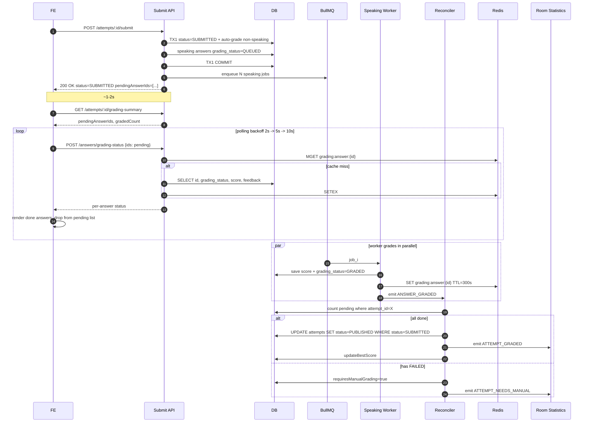

# Submit Attempt — Fire-and-Forget Grading Plan

> **Status**: Draft v1 — pending implementation
> **Owner**: Backend (oe-exam-api) + FE (student app)
> **Goal**: Reduce `POST /api/v1/student/attempts/:id/submit` latency from **~60s → <2s** by decoupling speaking grading from the submit request, while keeping result accuracy and side-effects (best-score, leaderboard, notifications) correct.

---

## 1. Background

### 1.1 Current behaviour

The submit endpoint at [`AttemptsController.submitAttempt()`](src/modules/student/attempts/controllers/attempts.controller.ts:321) executes synchronously inside one DB transaction:

1. Set `attempt.status = SUBMITTED`
2. Call [`GradingService.gradeAttempt()`](src/modules/student/attempts/services/grading/grading.service.ts:69)
   - Auto-grade MCQ/Reading/Listening (cheap, ~50ms)
   - Enqueue speaking jobs to BullMQ
   - **Wait** for each speaking answer up to 30s via `waitForSpeakingGrade()` (Quick Win: now parallel + 10s)
   - Batch save answers
3. Update best score → emit `ATTEMPT_GRADED` → notifications
4. Commit TX, return response

### 1.2 Pain points

| Issue | Impact |
|-------|--------|
| Submit latency 30–60s | Bad UX, HTTP timeouts on mobile |
| Long-held DB transaction | Connection pool pressure |
| Speaking AI is the only slow part but blocks the whole request | Coupling |
| Best-score/leaderboard wait for speaking grading | Unable to fire-and-forget today |

### 1.3 Quick Win already shipped (Phase 0)

- Parallel speaking polling via `Promise.all`
- `SPEAKING_WAIT_ON_SUBMIT_MS` env (default 10s)
- Batch save with `chunk: 50`
- Timing logs in [`gradeAttempt()`](src/modules/student/attempts/services/grading/grading.service.ts:69)

Result: ~60s → ~10–12s. But after timeout, attempt may stay in `SUBMITTED` with `requiresManualGrading=true` even after worker eventually finishes. Phase 1 (AttemptReconciler) addresses that.

---

## 2. Target Architecture



---

## 3. Data Model Changes

### 3.1 New enum `AnswerGradingStatus`

`src/modules/student/attempts/enums/answer-grading-status.enum.ts`

```ts
export enum AnswerGradingStatus {
  PENDING = 'PENDING',           // not yet submitted (no audio/answer)
  QUEUED = 'QUEUED',             // enqueued to BullMQ
  PROCESSING = 'PROCESSING',     // worker actively grading
  GRADED = 'GRADED',             // AI graded successfully
  FAILED = 'FAILED',             // AI failed after retries -> needs manual
  MANUAL_REVIEW = 'MANUAL_REVIEW', // assigned to teacher
  COMPLETED = 'COMPLETED',       // teacher finished grading
  AUTO_GRADED = 'AUTO_GRADED',   // synchronous MCQ/Reading/Listening
}
```

### 3.2 Add columns to `attempt_answers`

| Column | Type | Default | Notes |
|--------|------|---------|-------|
| `grading_status` | varchar(20) | `'PENDING'` | indexed |
| `grading_attempts` | int | 0 | retry counter |
| `grading_job_id` | varchar(64) | NULL | BullMQ job id |
| `grading_error` | text | NULL | last error message |
| `grading_started_at` | timestamptz | NULL | for stuck-job detection |

**Index**: `CREATE INDEX idx_answers_attempt_grading ON attempt_answers(attempt_id, grading_status);`

### 3.3 Migration

`src/database/migrations/{timestamp}-AddGradingStatusToAttemptAnswers.ts`

```ts
export class AddGradingStatusToAttemptAnswers implements MigrationInterface {
  public async up(q: QueryRunner): Promise<void> {
    await q.query(`
      ALTER TABLE attempt_answers
        ADD COLUMN grading_status varchar(20) NOT NULL DEFAULT 'PENDING',
        ADD COLUMN grading_attempts int NOT NULL DEFAULT 0,
        ADD COLUMN grading_job_id varchar(64),
        ADD COLUMN grading_error text,
        ADD COLUMN grading_started_at timestamptz;
    `);
    await q.query(`
      CREATE INDEX idx_answers_attempt_grading
        ON attempt_answers(attempt_id, grading_status);
    `);
    // Backfill existing data
    await q.query(`
      UPDATE attempt_answers
      SET grading_status = CASE
        WHEN score IS NOT NULL THEN 'GRADED'
        WHEN audio_key IS NOT NULL THEN 'GRADED'
        ELSE 'PENDING'
      END;
    `);
  }

  public async down(q: QueryRunner): Promise<void> {
    await q.query(`DROP INDEX IF EXISTS idx_answers_attempt_grading;`);
    await q.query(`
      ALTER TABLE attempt_answers
        DROP COLUMN grading_started_at,
        DROP COLUMN grading_error,
        DROP COLUMN grading_job_id,
        DROP COLUMN grading_attempts,
        DROP COLUMN grading_status;
    `);
  }
}
```

---

## 4. State Machines

### 4.1 Attempt status

```
IN_PROGRESS -> SUBMITTED -> PUBLISHED
                       \-> GRADED (has manual essays / failed AI)
                            \-> PUBLISHED (teacher finished)
```

### 4.2 Per-answer grading_status

```
PENDING (no submission)
  -> AUTO_GRADED (MCQ/Reading/Listening, sync at submit)
  -> QUEUED (speaking enqueued)
       -> PROCESSING (worker picks up)
            -> GRADED (success)
            -> FAILED (retries exhausted) -> MANUAL_REVIEW -> COMPLETED
```

Writing essays go directly: `PENDING -> MANUAL_REVIEW -> COMPLETED`.

---

## 5. Backend Changes

### 5.1 Refactor `submitAttempt` (split TX, fire-and-forget)

[`AttemptsService.submitAttempt()`](src/modules/student/attempts/services/attempts.service.ts:478) becomes:

```ts
async submitAttempt(attemptId, studentId): Promise<SubmitResponse> {
  // TX1: lock + set SUBMITTED + sync auto-grade non-speaking + enqueue speaking
  const result = await this.dataSource.transaction(async (qr) => {
    const attempt = await qr.manager.findOne(Attempt, {
      where: { id: attemptId, studentId },
      lock: { mode: 'pessimistic_write' },
    });
    if (!attempt) throw NotFoundException;
    if (attempt.status !== IN_PROGRESS) return { attempt, pendingAnswerIds: [] };

    // 1. Sync auto-grade MCQ/Reading/Listening
    const { autoGradedAnswers, pendingSpeakingAnswers } =
      await this.gradingService.classifyAndAutoGrade(attempt, qr.manager);

    // 2. Mark speaking as QUEUED
    for (const a of pendingSpeakingAnswers) {
      a.gradingStatus = AnswerGradingStatus.QUEUED;
    }

    // 3. Batch save
    await qr.manager.save(AttemptAnswer, [...autoGradedAnswers, ...pendingSpeakingAnswers], { chunk: 50 });

    // 4. Update attempt
    attempt.status = AttemptStatus.SUBMITTED;
    attempt.submittedAt = new Date();
    await qr.manager.save(attempt);

    return { attempt, pendingSpeakingAnswers };
  });

  // OUTSIDE TX: enqueue Bull jobs (non-blocking)
  for (const a of result.pendingSpeakingAnswers) {
    const jobId = await this.speakingQueue.enqueue({
      attemptId, answerId: a.id, audioKey: a.audioKey, ...
    });
    // best-effort save jobId for traceability
    await this.attemptAnswerRepository.update(a.id, { gradingJobId: jobId });
  }

  // Emit ATTEMPT_SUBMITTED event (downstream may pre-warm caches)
  this.eventEmitter.emit(ROOM_STATISTICS_EVENTS.ATTEMPT_SUBMITTED, {...});

  return {
    attempt: result.attempt,
    pendingAnswerIds: result.pendingSpeakingAnswers.map(a => a.id),
  };
}
```

**Key change**: `gradeAttempt()` is no longer called here. Speaking grading happens entirely in workers.

### 5.2 New: `GradingStatusService`

`src/modules/student/attempts/services/grading-status.service.ts`

```ts
@Injectable()
export class GradingStatusService {
  constructor(
    @InjectRepository(AttemptAnswer) private readonly answerRepo,
    @InjectRedis() private readonly redis,
  ) {}

  async getSummary(attemptId: string, studentId: string): Promise<GradingSummary> {
    // verify ownership
    const counts = await this.answerRepo
      .createQueryBuilder('a')
      .select('a.grading_status', 'status')
      .addSelect('COUNT(*)::int', 'count')
      .where('a.attempt_id = :attemptId', { attemptId })
      .groupBy('a.grading_status')
      .getRawMany();

    const pending = await this.answerRepo.find({
      where: {
        attemptId,
        gradingStatus: In([QUEUED, PROCESSING]),
      },
      select: ['id'],
    });

    return {
      attemptStatus,
      totalAnswers,
      gradedCount,
      pendingAnswerIds: pending.map(p => p.id),
      failedAnswerIds: [...],
    };
  }

  async getAnswersStatus(attemptId, answerIds: string[]): Promise<AnswerStatusItem[]> {
    if (answerIds.length === 0) return [];

    // 1. Try Redis batch
    const cacheKeys = answerIds.map(id => `grading:answer:${id}`);
    const cached = await this.redis.mget(...cacheKeys);
    const result: AnswerStatusItem[] = [];
    const missing: string[] = [];
    cached.forEach((raw, idx) => {
      if (raw) result.push(JSON.parse(raw));
      else missing.push(answerIds[idx]);
    });

    // 2. DB fallback for missing
    if (missing.length > 0) {
      const rows = await this.answerRepo.find({
        where: { id: In(missing), attemptId },
        select: ['id', 'gradingStatus', 'score', 'maxScore', 'feedback', 'gradedAt'],
      });
      for (const r of rows) {
        const item = this.toStatusItem(r);
        const ttl = this.isTerminal(r.gradingStatus) ? 300 : 2;
        await this.redis.setex(`grading:answer:${r.id}`, ttl, JSON.stringify(item));
        result.push(item);
      }
    }

    return result;
  }
}
```

### 5.3 New endpoints

#### `GET /api/v1/student/attempts/:id/grading-summary`

Lightweight overview, called once when FE enters result page.

```ts
@Get(':attemptId/grading-summary')
async getGradingSummary(
  @Param('attemptId') attemptId: string,
  @Session() session,
): Promise<GradingSummaryResponse> { ... }
```

Response:
```json
{
  "attemptId": "uuid",
  "attemptStatus": "SUBMITTED",
  "totalAnswers": 5,
  "gradedCount": 2,
  "pendingAnswerIds": ["uuid2", "uuid4"],
  "failedAnswerIds": [],
  "manualReviewAnswerIds": []
}
```

#### `POST /api/v1/student/attempts/:id/answers/grading-status`

Batch query specific answers (FE polling endpoint).

```ts
@Post(':attemptId/answers/grading-status')
async getAnswersGradingStatus(
  @Param('attemptId') attemptId: string,
  @Body() dto: { answerIds: string[] },
  @Session() session,
): Promise<{ answers: AnswerStatusItem[]; allCompleted: boolean }> { ... }
```

Response:
```json
{
  "answers": [
    {
      "answerId": "uuid2",
      "gradingStatus": "GRADED",
      "score": 7.5,
      "maxScore": 10,
      "feedback": "Good fluency...",
      "gradedAt": "2026-05-01T03:30:00Z"
    },
    {
      "answerId": "uuid4",
      "gradingStatus": "PROCESSING",
      "score": null,
      "maxScore": 10
    }
  ],
  "allCompleted": false
}
```

**Validation**:
- DTO: `answerIds` array max 50 items, each UUID.
- Verify all answerIds belong to the attempt and the attempt belongs to studentId.
- Throttle: 30 req/min per attemptId via `@nestjs/throttler`.

### 5.4 Speaking Worker updates

[`SpeakingGradingProcessor.process()`](src/modules/student/attempts/processors/speaking-grading.processor.ts):

```ts
async process(job): Promise<...> {
  await this.markProcessing(job.data.answerId);
  try {
    const score = await this.gradeWithAI(...);
    await this.saveGradedAnswer(answerId, score, feedback);
    await this.cache.setex(`grading:answer:${answerId}`, 300, JSON.stringify(...));
    this.eventEmitter.emit(SPEAKING_GRADING_EVENTS.ANSWER_GRADED, {...});
    return { success: true, score };
  } catch (err) {
    if (job.attemptsMade >= job.opts.attempts) {
      await this.markFailed(answerId, err.message); // -> grading_status=FAILED, requiresManualGrading=true
      this.eventEmitter.emit(SPEAKING_GRADING_EVENTS.ANSWER_FAILED, {...});
    }
    throw err; // BullMQ retry
  }
}
```

Bull job options:
```ts
{
  attempts: 3,
  backoff: { type: 'exponential', delay: 5000 },
  removeOnComplete: { age: 86400, count: 1000 },
  removeOnFail: false, // keep for inspection
}
```

### 5.5 AttemptReconciler (Phase 1, in progress)

`src/modules/student/attempts/services/attempt-reconciler.service.ts`

```ts
@Injectable()
export class AttemptReconcilerService {
  @OnEvent(SPEAKING_GRADING_EVENTS.ANSWER_GRADED)
  @OnEvent(SPEAKING_GRADING_EVENTS.ANSWER_FAILED)
  async handleAnswerStateChange(payload: { attemptId: string }) {
    await this.tryPromote(payload.attemptId);
  }

  private async tryPromote(attemptId: string): Promise<void> {
    // 1. count outstanding work
    const pending = await this.answerRepo.count({
      where: {
        attemptId,
        gradingStatus: In([QUEUED, PROCESSING]),
      },
    });
    if (pending > 0) return;

    // 2. check failed -> requires manual
    const failed = await this.answerRepo.count({
      where: { attemptId, gradingStatus: In([FAILED, MANUAL_REVIEW]) },
    });

    // 3. aggregate scores
    const totals = await this.computeTotals(attemptId);

    // 4. conditional UPDATE for idempotency / race safety
    const targetStatus = failed > 0 ? AttemptStatus.GRADED : AttemptStatus.PUBLISHED;
    const result = await this.attemptRepo
      .createQueryBuilder()
      .update(Attempt)
      .set({
        status: targetStatus,
        totalScore: totals.totalScore,
        sectionScores: totals.sectionScores,
        requiresManualGrading: failed > 0,
        publishedAt: targetStatus === PUBLISHED ? () => 'NOW()' : undefined,
      })
      .where('id = :id AND status = :submitted', { id: attemptId, submitted: SUBMITTED })
      .execute();

    if (result.affected === 0) return; // already promoted by another event

    // 5. side effects
    if (targetStatus === PUBLISHED) {
      await this.studentBestScoreService.updateBestScore(attempt);
      this.eventEmitter.emit(ROOM_STATISTICS_EVENTS.ATTEMPT_GRADED, {...});
    } else {
      this.eventEmitter.emit(ROOM_STATISTICS_EVENTS.ATTEMPT_NEEDS_MANUAL, {...});
    }
  }
}
```

### 5.6 Janitor cron (stuck job detector)

`src/modules/student/attempts/jobs/grading-janitor.job.ts`

```ts
@Injectable()
export class GradingJanitorJob {
  @Cron('*/2 * * * *') // every 2 minutes
  async detectStuckAnswers() {
    const cutoff = new Date(Date.now() - 5 * 60 * 1000);
    const stuck = await this.answerRepo.find({
      where: {
        gradingStatus: In([QUEUED, PROCESSING]),
        gradingStartedAt: LessThan(cutoff),
      },
    });
    for (const a of stuck) {
      await this.answerRepo.update(a.id, {
        gradingStatus: AnswerGradingStatus.FAILED,
        gradingError: 'STUCK_TIMEOUT',
      });
      this.eventEmitter.emit(SPEAKING_GRADING_EVENTS.ANSWER_FAILED, {
        attemptId: a.attemptId, answerId: a.id, score: null,
      });
    }
  }
}
```

---

## 6. FE Polling Contract

### 6.1 Flow

1. After successful `POST /submit` → response includes `pendingAnswerIds[]`. If empty → go straight to result page.
2. On result page mount → `GET /grading-summary` to get authoritative pending list.
3. Start polling loop:
   - `POST /answers/grading-status` with **only** the still-pending IDs.
   - For each answer that returned terminal status (`GRADED`, `FAILED`, `MANUAL_REVIEW`, `COMPLETED`) → render result + remove from pending list.
   - Sleep with backoff: 2s → 3s → 5s → 8s → 10s (cap 10s).
4. Stop polling when:
   - `pendingAnswerIds.length === 0`, OR
   - Total elapsed > 3 minutes → show "Kết quả sẽ có sau, hãy quay lại sau" message.

### 6.2 UI mapping

| `gradingStatus` | UI |
|---|---|
| `AUTO_GRADED`, `GRADED`, `COMPLETED` | Show score + feedback |
| `QUEUED`, `PROCESSING` | Spinner "Đang chấm điểm AI..." |
| `FAILED`, `MANUAL_REVIEW` | Badge "Sẽ được giáo viên chấm" |

---

## 7. Side-effect Realignment

| Side-effect | Old trigger | New trigger |
|---|---|---|
| `updateBestScore` | Inside `submitAttempt` | Inside `AttemptReconciler.tryPromote()` when status → PUBLISHED |
| `ROOM_STATISTICS_EVENTS.ATTEMPT_GRADED` | After submit TX commit | After reconciler promotes |
| Notification "kết quả đã có" | After submit | After reconciler promotes |
| Activity log "submitted" | Submit TX commit | Unchanged |

---

## 8. Feature Flag & Rollout

`SUBMIT_FAST_RETURN` env var:
- `false` (default during transition) → keep current `gradeAttempt()` waiting behaviour.
- `true` → fire-and-forget mode.

Rollout:
1. Deploy backend with flag = false. Verify schema migration + reconciler works with existing flow.
2. Enable flag = true on staging. Run full E2E.
3. Canary: 1 branch / 1 contest → monitor metrics.
4. Gradual: 10% → 50% → 100% over 1–2 weeks.
5. Remove flag + dead code after stable.

---

## 9. Observability

### Metrics to add

- `submit_attempt_duration_ms` histogram (p50/p95/p99) — target p95 < 2s
- `speaking_grading_duration_ms` histogram per job
- `speaking_grading_failures_total` counter (label: reason)
- `grading_pending_answers_gauge` (open jobs in QUEUED/PROCESSING)
- `grading_janitor_recovered_total` counter

### Logs

- Structured logs with `attemptId`, `answerId`, `gradingJobId` correlation
- Existing timing log in `gradeAttempt` extended with phase markers

### Alerts

- Janitor recovers > 10 stuck answers in 5min → page on-call
- p95 submit > 5s → warning
- BullMQ DLQ depth > 100 → page

---

## 10. Risks & Mitigations

| Risk | Mitigation |
|---|---|
| FE doesn't update polling loop → stale UI | Backward-compat: keep `attempt.status` accurate; FE can fall back to polling whole attempt |
| Bull queue down → all submits fail to grade | Health check + alert; janitor fallback to manual after timeout |
| Redis cache inconsistent with DB | Worker writes DB first then cache; cache TTL short (2s) for non-terminal |
| Reconciler double-promotes | Conditional `WHERE status='SUBMITTED'` UPDATE — affected=0 means no-op |
| Migration on large `attempt_answers` table | Run during low-traffic window; backfill in batches if > 1M rows |
| Existing in-flight attempts at deploy | Reconciler picks them up via janitor cron after deploy |

---

## 11. Phased Rollout Checklist

### Phase 0 — Quick Win (DONE)
- [x] Parallel speaking polling
- [x] `SPEAKING_WAIT_ON_SUBMIT_MS` env
- [x] Batch save
- [x] Timing logs

### Phase 1 — AttemptReconciler (IN PROGRESS)
- [x] `SPEAKING_GRADING_EVENTS.ANSWER_GRADED` event file
- [x] Worker emits event after save
- [ ] `AttemptReconcilerService` listener with conditional UPDATE
- [ ] Register in `AttemptsModule`
- [ ] Unit tests for race conditions

### Phase 2 — Schema migration
- [ ] `AnswerGradingStatus` enum
- [ ] Add columns to `attempt_answers` + index
- [ ] Backfill existing rows
- [ ] Update [`AttemptAnswer`](src/modules/student/attempts/entities/attempt-answer.entity.ts:16) entity

### Phase 3 — Worker + reconciler use new state
- [ ] Worker sets `grading_status` transitions: QUEUED → PROCESSING → GRADED/FAILED
- [ ] Worker writes Redis cache after grade
- [ ] Reconciler queries by `grading_status` instead of `score IS NULL`
- [ ] `ANSWER_FAILED` event + retry policy in Bull config
- [ ] Janitor cron job

### Phase 4 — New endpoints
- [ ] `GradingStatusService`
- [ ] `GET /grading-summary` endpoint + DTO
- [ ] `POST /answers/grading-status` endpoint + DTO
- [ ] Throttle + ownership guards
- [ ] Swagger docs

### Phase 5 — Fire-and-forget submit
- [ ] Refactor `submitAttempt` (split TX, no `gradeAttempt` call)
- [ ] `classifyAndAutoGrade()` helper in `GradingService` (sync part only)
- [ ] Move side-effects to reconciler
- [ ] Feature flag `SUBMIT_FAST_RETURN`

### Phase 6 — FE integration
- [ ] FE consumes `pendingAnswerIds` from submit response
- [ ] Polling loop with backoff
- [ ] UI states for QUEUED/PROCESSING/FAILED/MANUAL_REVIEW
- [ ] Stop after 3min + fallback message

### Phase 7 — Observability
- [ ] Prometheus metrics
- [ ] Structured logs
- [ ] Alerts on Grafana

### Phase 8 — Rollout
- [ ] Staging canary
- [ ] 10% / 50% / 100% production
- [ ] Remove feature flag + dead code

---

## 12. Open Questions

1. **Writing essays**: do they need `grading_status = MANUAL_REVIEW` on submit? (Currently `requiresManualGrading=true` flag only. Recommendation: yes, for consistency.)
2. **Notification on grading complete**: in-app push? email? out of scope here, but reconciler is the right hook.
3. **Leaderboard freshness SLA**: acceptable to lag 3 minutes after submit batch?
4. **Per-section best score** (e.g., reading-only best): does reconciler need to update per section? Current `updateBestScore` works at attempt level.
5. **Re-grading flow**: if teacher manually re-grades a `GRADED` answer, who recomputes attempt totals? Likely a separate `AttemptRescoreService`.

---

## 13. References

- Current submit logic: [`AttemptsService.submitAttempt()`](src/modules/student/attempts/services/attempts.service.ts:478)
- Grading service: [`GradingService.gradeAttempt()`](src/modules/student/attempts/services/grading/grading.service.ts:69)
- Speaking processor: [`SpeakingGradingProcessor`](src/modules/student/attempts/processors/speaking-grading.processor.ts:34)
- Existing events: [`room-statistics.events.ts`](src/core/rooms/events/room-statistics.events.ts:1)
- Quick Win constants: [`speaking-grading.constants.ts`](src/modules/student/attempts/constants/speaking-grading.constants.ts:1)
