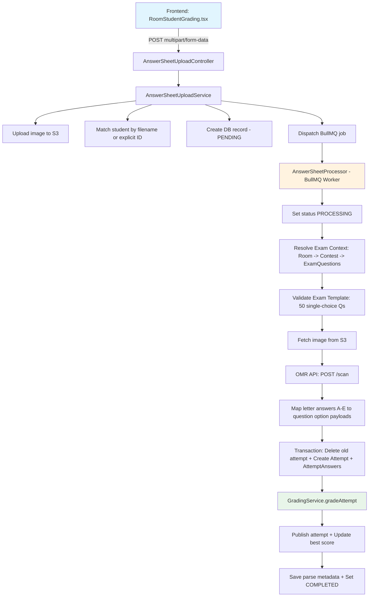
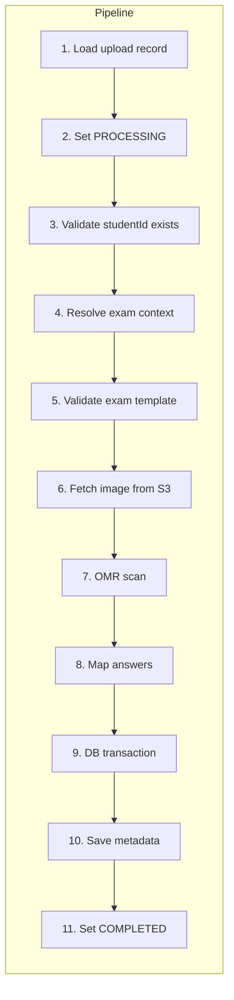
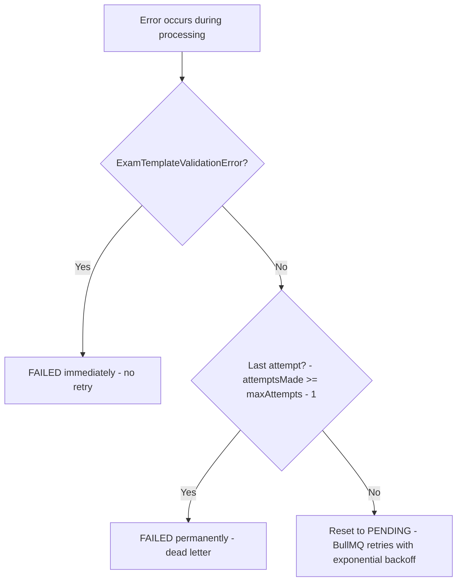
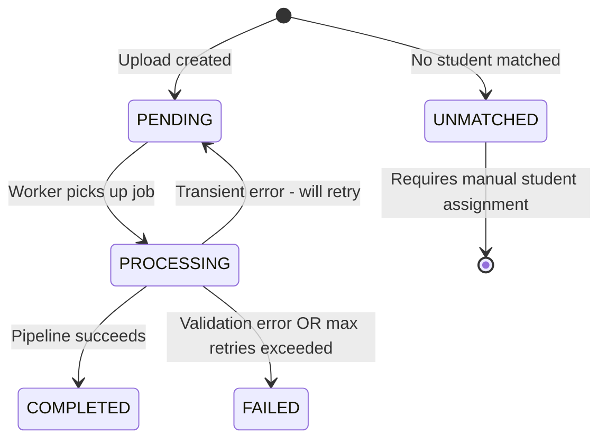

# Upload Answer Sheets — Scoring Flow Documentation

## Overview

The `POST /api/v1/manage/rooms/:roomId/upload-answer-sheets` endpoint allows admins/teachers to upload scanned bubble-sheet images for a given exam room. The system processes these images asynchronously: it detects filled bubbles via an OMR (Optical Mark Recognition) API, maps detected answers to exam questions, creates student attempts, and grades them algorithmically — all without manual intervention.

---

## Architecture Diagram



---

## Detailed Flow

### Phase 1: HTTP Request Handling

**File:** [`answer-sheet-upload.controller.ts`](oe-exam-api/src/modules/manage/rooms/answer-sheet-upload/controllers/answer-sheet-upload.controller.ts)

1. **Endpoint:** `POST /api/v1/manage/rooms/:roomId/upload-answer-sheets`
2. **Authentication:** JWT via `AuthGuard`, role-restricted to `SYSTEM_ADMIN`, `ADMIN`, `TEACHER`
3. **File constraints:**
   - Max **50 files** per request
   - Max **10 MB** per file
   - Only image MIME types accepted (`image/*`)
4. **Body (multipart/form-data):**
   - `files` — array of image files (answer sheet scans)
   - `studentId` — optional UUID; if provided, all files are assigned to this student

The controller delegates to [`answerSheetUploadService.uploadAnswerSheets()`](oe-exam-api/src/modules/manage/rooms/answer-sheet-upload/services/answer-sheet-upload.service.ts:76).

---

### Phase 2: Upload & Dispatch (Synchronous)

**File:** [`answer-sheet-upload.service.ts`](oe-exam-api/src/modules/manage/rooms/answer-sheet-upload/services/answer-sheet-upload.service.ts)

For **each uploaded file**, the service performs:

#### 2.1 Validate Room
- Confirms the exam room exists in the database

#### 2.2 Student Resolution
Two strategies:

| Strategy | Condition | Logic |
|----------|-----------|-------|
| **Explicit** | `studentId` is provided in request body | Validates student is a `USER`-type participant in the room |
| **Filename matching** | No `studentId` provided | Strips file extension, case-insensitive match against participant `email`, `username`, or `name` |

If no student can be matched, the upload record is created with status **`UNMATCHED`** (no BullMQ job dispatched).

#### 2.3 S3 Upload
- Generates S3 key: `answer-sheets/{roomId}/{uuid}_{originalFilename}`
- Uploads the image buffer to S3

#### 2.4 Create DB Record
Creates an [`AnswerSheetUpload`](oe-exam-api/src/modules/manage/rooms/answer-sheet-upload/entities/answer-sheet-upload.entity.ts) entity with:
- `examRoomId`, `studentId`, `originalFilename`, `s3Key`, `mimeType`, `fileSize`
- `status = PENDING`

#### 2.5 Dispatch BullMQ Job
Enqueues a job to `ANSWER_SHEET_QUEUE` with payload `{ answerSheetUploadId }` and options:
- **3 attempts** with exponential backoff
- Saves `jobId` back to the upload record

#### 2.6 Response
Returns immediately with an array of [`AnswerSheetUploadResponseItem`](oe-exam-api/src/modules/manage/rooms/answer-sheet-upload/dto/upload-answer-sheets-response.dto.ts) — one per file — containing `id`, `status`, `s3Key`, etc.

---

### Phase 3: Background Processing (Asynchronous)

**File:** [`answer-sheet.processor.ts`](oe-exam-api/src/modules/manage/rooms/answer-sheet-upload/processors/answer-sheet.processor.ts)

The BullMQ worker (`AnswerSheetProcessor`) picks up jobs from `ANSWER_SHEET_QUEUE` and executes the following pipeline:



#### Step 4: Resolve Exam Context
[`resolveExamContext()`](oe-exam-api/src/modules/manage/rooms/answer-sheet-upload/processors/answer-sheet.processor.ts:286) — Two resolution paths:

1. **Direct exam reference:** If `examRoom.parentExamId` or `examRoom.examId` exists → use as `examId`, query `exam_questions` where `exam_id = roomExamId`
2. **Contest-based:** Use `contest.childExamIds` to query `exam_questions`

Returns: `{ examId, contestId, examQuestions[] }` — each `examQuestion` includes its linked `Question` entity with `correct_answer`, `options`, `question_type`, `points`, etc.

#### Step 5: Validate Exam Template
[`validateExamTemplate()`](oe-exam-api/src/modules/manage/rooms/answer-sheet-upload/utils/validate-exam-template.util.ts:57) — Enforces:

- **Exactly 50 questions** (matching the physical bubble sheet)
- **All single-choice type** (one of: `LISTEN_AND_CHOOSE_ANSWER`, `READ_AND_CHOOSE_BEST_ANSWER`, `READ_AND_CHOOSE_APPROPRIATE_WORD`, `LOOK_PICTURE_CHOOSE_CORRECT_ANSWER`, `CHOOSE_THE_CORRECT_ANSWER`, `CHOOSE_CORRECT_ADJECTIVE`)
- **Each question has ≥ 2 options**

If validation fails, throws [`ExamTemplateValidationError`](oe-exam-api/src/modules/manage/rooms/answer-sheet-upload/utils/validate-exam-template.util.ts:27) → **FAILED immediately, no retry**.

#### Step 7: OMR Scan
[`OmrParseService.parse()`](oe-exam-api/src/modules/manage/rooms/answer-sheet-upload/omr/omr-parse.service.ts:39) → [`OmrApiClient`](oe-exam-api/src/modules/manage/rooms/answer-sheet-upload/omr/omr-api.client.ts:38)

- Sends the image buffer as `multipart/form-data` to the self-hosted OMR Checker API (`POST /scan`)
- **OMR API response:**
  ```json
  {
    "answers": { "q1": "A", "q2": "B", "q3": null, ... "q50": "D" },
    "multi_marked": [15, 32],
    "processing_time_ms": 1234
  }
  ```
- The `OmrParseService` transforms this into a [`BlockParseResult`](oe-exam-api/src/modules/manage/rooms/answer-sheet-upload/omr/omr-parse.types.ts:31) with structured answer items:
  - `letter`: "A"-"E" or `null`
  - `status`: `selected` | `blank` | `multiple_marks`
  - `confidence`: `1.0` for selected, `0` for blank/multi-marked

#### Step 8: Map Answers to Payloads
[`mapAnswersToPayloads()`](oe-exam-api/src/modules/manage/rooms/answer-sheet-upload/processors/answer-sheet.processor.ts:364) — For each of the 50 answers:

Using [`mapLetterToAnswer()`](oe-exam-api/src/modules/manage/rooms/answer-sheet-upload/utils/letter-to-option.util.ts:56):
- If question has **object options** (with `id` field): maps letter A→option[0], B→option[1], etc. → returns `{ optionId: "<uuid>" }`
- If question has **string options**: maps letter to 1-based index → returns `{ answer: N }`
- If letter is `null` (blank/multi-marked): returns `null` → answer payload is skipped

#### Step 9: Database Transaction

Within a single transaction with **pessimistic locking**:

1. **Delete existing attempt** — [`deleteExistingAttempt()`](oe-exam-api/src/modules/manage/rooms/answer-sheet-upload/processors/answer-sheet.processor.ts:402)
   - Uses `SELECT ... FOR UPDATE` to lock the existing attempt row
   - Deletes the attempt (cascade deletes `AttemptAnswers`)
   - Prevents race conditions from concurrent uploads for the same student

2. **Create Attempt** — [`createAttemptWithAnswers()`](oe-exam-api/src/modules/manage/rooms/answer-sheet-upload/processors/answer-sheet.processor.ts:431)
   - Creates a new `Attempt` entity with `status = IN_PROGRESS`
   - Creates `AttemptAnswer` entities for each mapped answer (with `score = null`, `isCorrect = null`)

3. **Grade** — [`GradingService.gradeAttempt()`](oe-exam-api/src/modules/student/attempts/services/grading/grading.service.ts:65)
   - Iterates through all `AttemptAnswer` records
   - For each answer, calls [`gradeAnswer()`](oe-exam-api/src/modules/student/attempts/services/grading/grading.service.ts:38) which routes to [`ReadingListeningGradingStrategy.grade()`](oe-exam-api/src/modules/student/attempts/services/grading/strategies/reading-listening-grading.strategy.ts:20)
   - Since all questions are single-choice, uses [`gradeSingleChoice()`](oe-exam-api/src/modules/student/attempts/services/grading/strategies/reading-listening-grading.strategy.ts:129):
     ```
     studentValue = answer.optionId || answer.answer
     correctValue = correctAnswer.optionId || correctAnswer.answer
     isCorrect = studentValue === correctValue
     score = isCorrect ? maxScore : 0
     ```
   - Each `AttemptAnswer` is updated with `isCorrect` and `score`, then saved
   - Returns `{ totalScore, hasEssayQuestions: false, ungradedEssayCount: 0 }`

4. **Publish** — Sets `attempt.status = PUBLISHED`, saves total score and section scores

5. **Update best score** — Calls `studentBestScoreService.updateBestScore()` to maintain the leaderboard cache

6. **Commit transaction**

#### Steps 10-11: Finalization
After the transaction commits:
- Computes [`overallConfidence`](oe-exam-api/src/modules/manage/rooms/answer-sheet-upload/processors/answer-sheet.processor.ts:507) — average confidence across all 50 answers
- Computes [`reviewFlags`](oe-exam-api/src/modules/manage/rooms/answer-sheet-upload/processors/answer-sheet.processor.ts:519) — identifies answers needing human review:
  - `MULTIPLE_MARKS` — OMR detected multiple bubbles filled
  - `BLANK` — no bubble detected
  - `UNCLEAR` — ambiguous detection
  - `LOW_CONFIDENCE` — overall confidence below threshold
- Saves `parseMetadata` JSON (requestId, source, raw answers, block latencies, unmapped answers)
- Sets `status = COMPLETED` and `processedAt = now()`

---

### Error Handling & Retry Logic



- **Non-retryable:** `ExamTemplateValidationError` → immediately `FAILED`
- **Retryable:** All other errors → retry up to **3 attempts** with exponential backoff
- **Recovery cron:** Every 5 minutes, [`recoverOrphanedUploads()`](oe-exam-api/src/modules/manage/rooms/answer-sheet-upload/services/answer-sheet-upload.service.ts:346) finds `PENDING` uploads without a `jobId` that are older than 2 minutes, and re-dispatches them

---

### Status Lifecycle



| Status | Description |
|--------|-------------|
| `PENDING` | Uploaded, waiting for BullMQ worker |
| `PROCESSING` | Worker is actively processing |
| `COMPLETED` | Successfully graded, attempt created |
| `FAILED` | Permanently failed after retries or validation error |
| `UNMATCHED` | No student could be matched to this file |

---

### Grading Logic Detail (for OMR answer sheets)

Since the exam template is constrained to **50 single-choice questions**, the grading is purely deterministic:

1. For each question, the student's selected option (`optionId` or 1-based index) is compared against the `correct_answer`
2. **Binary scoring:** `isCorrect ? points : 0` (default `points = 1` per question)
3. **Total score** = sum of individual question scores
4. No essay questions → `hasEssayQuestions = false`
5. Points are validated via [`validateTotalPoints()`](oe-exam-api/src/modules/student/attempts/services/grading/grading.utils.ts:30) — must be numeric, 0-999.99, defaults to 1

---

### Key Source Files

| Component | File |
|-----------|------|
| Controller | [`answer-sheet-upload.controller.ts`](oe-exam-api/src/modules/manage/rooms/answer-sheet-upload/controllers/answer-sheet-upload.controller.ts) |
| Upload Service | [`answer-sheet-upload.service.ts`](oe-exam-api/src/modules/manage/rooms/answer-sheet-upload/services/answer-sheet-upload.service.ts) |
| BullMQ Processor | [`answer-sheet.processor.ts`](oe-exam-api/src/modules/manage/rooms/answer-sheet-upload/processors/answer-sheet.processor.ts) |
| OMR API Client | [`omr-api.client.ts`](oe-exam-api/src/modules/manage/rooms/answer-sheet-upload/omr/omr-api.client.ts) |
| OMR Parse Service | [`omr-parse.service.ts`](oe-exam-api/src/modules/manage/rooms/answer-sheet-upload/omr/omr-parse.service.ts) |
| Letter-to-Option Util | [`letter-to-option.util.ts`](oe-exam-api/src/modules/manage/rooms/answer-sheet-upload/utils/letter-to-option.util.ts) |
| Exam Template Validator | [`validate-exam-template.util.ts`](oe-exam-api/src/modules/manage/rooms/answer-sheet-upload/utils/validate-exam-template.util.ts) |
| Grading Service | [`grading.service.ts`](oe-exam-api/src/modules/student/attempts/services/grading/grading.service.ts) |
| Reading/Listening Strategy | [`reading-listening-grading.strategy.ts`](oe-exam-api/src/modules/student/attempts/services/grading/strategies/reading-listening-grading.strategy.ts) |
| Upload Entity | [`answer-sheet-upload.entity.ts`](oe-exam-api/src/modules/manage/rooms/answer-sheet-upload/entities/answer-sheet-upload.entity.ts) |
| Request DTO | [`upload-answer-sheets-request.dto.ts`](oe-exam-api/src/modules/manage/rooms/answer-sheet-upload/dto/upload-answer-sheets-request.dto.ts) |
| Response DTO | [`upload-answer-sheets-response.dto.ts`](oe-exam-api/src/modules/manage/rooms/answer-sheet-upload/dto/upload-answer-sheets-response.dto.ts) |
| Status Enum | [`answer-sheet-upload-status.enum.ts`](oe-exam-api/src/modules/manage/rooms/answer-sheet-upload/enums/answer-sheet-upload-status.enum.ts) |
