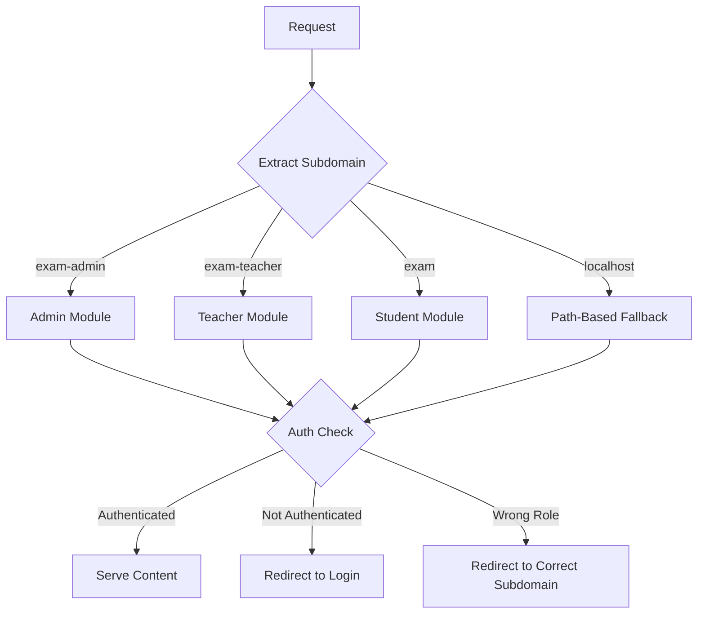

# Subdomain-Based Routing Implementation

> **Status: ✅ IMPLEMENTED**
> **Date: 2026-01-26**

## Overview

This document describes the subdomain-based routing implementation for the OceanEdu Exam Frontend application.

### Current State (Path-Based)
- `domain/admin/*` → Admin module
- `domain/teacher/*` → Teacher module  
- `domain/student/*` → Student module

### Target State (Subdomain-Based)
- `exam-admin.oceanedu.org` → `/admin/*` → Admin module
- `exam-teacher.oceanedu.org` → `/teacher/*` → Teacher module
- `exam.oceanedu.org` → `/student/*` → Student module

---

## Architecture



---

## Implementation Details

### 1. Middleware Updates (`middleware.ts`)

The middleware needs to be updated to:

1. **Extract subdomain** from the request hostname
2. **Map subdomain to role** and path prefix
3. **Rewrite URLs** to internal paths
4. **Validate user role** matches subdomain's expected role
5. **Fallback to path-based routing** for localhost development

#### Subdomain Configuration

```typescript
const SUBDOMAIN_CONFIG: Record<string, { role: UserRole; pathPrefix: string }> = {
  'exam-admin': { role: 'ADMIN', pathPrefix: '/admin' },
  'exam-teacher': { role: 'TEACHER', pathPrefix: '/teacher' },
  'exam': { role: 'STUDENT', pathPrefix: '/student' },
} as const;
```

#### Subdomain Extraction Logic

```typescript
function extractSubdomain(hostname: string): string | null {
  const baseDomain = process.env.NEXT_PUBLIC_BASE_DOMAIN || 'oceanedu.org';
  
  // Handle localhost for development
  if (hostname.includes('localhost') || hostname.includes('127.0.0.1')) {
    return null;
  }

  const hostWithoutPort = hostname.split(':')[0];
  
  if (!hostWithoutPort.endsWith(baseDomain)) {
    return null;
  }

  const subdomain = hostWithoutPort.replace(`.${baseDomain}`, '');
  
  if (subdomain === hostWithoutPort) {
    return null;
  }

  return subdomain;
}
```

#### URL Rewriting

When a user visits `exam-admin.oceanedu.org/dashboard`:
1. Middleware detects subdomain `exam-admin`
2. Maps to role `ADMIN` and prefix `/admin`
3. Rewrites URL to `/admin/dashboard`
4. Validates user has `ADMIN` role
5. Serves the content

### 2. Environment Configuration

Add new environment variables to support subdomain configuration:

```env
# .env.example / .env.local / .env.prod
NEXT_PUBLIC_BASE_DOMAIN=oceanedu.org
NEXT_PUBLIC_ADMIN_SUBDOMAIN=exam-admin
NEXT_PUBLIC_TEACHER_SUBDOMAIN=exam-teacher
NEXT_PUBLIC_STUDENT_SUBDOMAIN=exam
```

### 3. Next.js Configuration (`next.config.ts`)

Update Next.js config to support subdomain routing:

```typescript
import type { NextConfig } from 'next';

const nextConfig: NextConfig = {
  // Enable hostname configuration for subdomain support
  async rewrites() {
    return {
      beforeFiles: [],
      afterFiles: [],
      fallback: [],
    };
  },
  
  // Configure allowed hosts for security
  experimental: {
    // Allow all subdomains of oceanedu.org
  },
};

export default nextConfig;
```

### 4. Local Development Setup

For local development, we have two options:

#### Option A: Use hosts file (Recommended)
Add to `/etc/hosts` (Linux/Mac) or `C:\Windows\System32\drivers\etc\hosts` (Windows):

```
127.0.0.1 exam-admin.oceanedu.local
127.0.0.1 exam-teacher.oceanedu.local
127.0.0.1 exam.oceanedu.local
```

Update `.env.local`:
```env
NEXT_PUBLIC_BASE_DOMAIN=oceanedu.local
```

#### Option B: Path-based fallback
The middleware falls back to path-based routing on localhost, so existing development workflow continues to work.

---

## File Changes Summary

| File | Action | Description |
|------|--------|-------------|
| `middleware.ts` | Modify | Add subdomain extraction and routing logic |
| `.env.example` | Modify | Add NEXT_PUBLIC_BASE_DOMAIN |
| `.env.local` | Modify | Add local development domain config |
| `.env.prod` | Modify | Add production domain config |
| `next.config.ts` | Modify | Add subdomain configuration (optional) |
| `constants/routes.ts` | Modify | Update route helpers to support subdomains |

---

## New Middleware Implementation

See the complete implementation below:

```typescript
import { NextResponse } from 'next/server';
import type { NextRequest } from 'next/server';
import { API_ENDPOINTS, API_BASE_URL } from '@/constants/ApiConstant';

// =============================================================================
// TYPES & INTERFACES
// =============================================================================

type UserRole = 'ADMIN' | 'TEACHER' | 'STUDENT';

interface UserInfo {
  id: string;
  name: string;
  email: string;
  role: UserRole;
  phoneNumber: string;
}

interface AuthMeResponse {
  success: boolean;
  data: {
    userInfo: UserInfo;
    loginTime: string;
  };
}

// =============================================================================
// SUBDOMAIN CONFIGURATION
// =============================================================================

const SUBDOMAIN_CONFIG: Record<string, { role: UserRole; pathPrefix: string }> = {
  'exam-admin': { role: 'ADMIN', pathPrefix: '/admin' },
  'exam-teacher': { role: 'TEACHER', pathPrefix: '/teacher' },
  'exam': { role: 'STUDENT', pathPrefix: '/student' },
} as const;

function getBaseDomain(): string {
  return process.env.NEXT_PUBLIC_BASE_DOMAIN || 'oceanedu.org';
}

function extractSubdomain(hostname: string): string | null {
  const baseDomain = getBaseDomain();
  
  if (hostname.includes('localhost') || hostname.includes('127.0.0.1')) {
    return null;
  }

  const hostWithoutPort = hostname.split(':')[0];
  
  if (!hostWithoutPort.endsWith(baseDomain)) {
    return null;
  }

  const subdomain = hostWithoutPort.replace(`.${baseDomain}`, '');
  
  if (subdomain === hostWithoutPort) {
    return null;
  }

  return subdomain;
}

function getSubdomainConfig(hostname: string): { role: UserRole; pathPrefix: string } | null {
  const subdomain = extractSubdomain(hostname);
  
  if (!subdomain) {
    return null;
  }

  return SUBDOMAIN_CONFIG[subdomain] || null;
}

// =============================================================================
// CONFIGURATION
// =============================================================================

const PUBLIC_ROUTES = ['/', '/login', '/student/register'] as const;

const ROLE_ROUTES: Record<Lowercase<UserRole>, readonly string[]> = {
  admin: ['/admin'],
  teacher: ['/teacher'],
  student: ['/student'],
} as const;

const ROLE_DASHBOARDS: Record<UserRole, string> = {
  ADMIN: '/admin/dashboard',
  TEACHER: '/teacher/dashboard',
  STUDENT: '/student/dashboard',
} as const;

// =============================================================================
// HELPER FUNCTIONS
// =============================================================================

function isPublicRoute(pathname: string): boolean {
  return PUBLIC_ROUTES.some(
    (route) => pathname === route || (route !== '/' && pathname.startsWith(route))
  );
}

function hasRoutePermission(pathname: string, userRole: UserRole): boolean {
  if (userRole === 'ADMIN') {
    return true;
  }

  const roleLower = userRole.toLowerCase() as Lowercase<UserRole>;

  for (const [role, routes] of Object.entries(ROLE_ROUTES)) {
    const isProtectedRoute = routes.some((route) => pathname.startsWith(route));
    if (isProtectedRoute) {
      return roleLower === role;
    }
  }

  return true;
}

async function fetchUserInfo(cookieHeader: string): Promise<AuthMeResponse | null> {
  const apiUrl = `${API_BASE_URL}${API_ENDPOINTS.AUTH.ME}`;

  try {
    const response = await fetch(apiUrl, {
      method: 'GET',
      headers: {
        'Content-Type': 'application/json',
        Cookie: cookieHeader,
      },
      credentials: 'include',
      signal: AbortSignal.timeout(5000),
    });

    if (!response.ok) {
      return null;
    }

    return await response.json();
  } catch (error) {
    if (process.env.NODE_ENV === 'development') {
      console.error('[Middleware] Auth API error:', error);
    }
    return null;
  }
}

function buildSubdomainUrl(
  request: NextRequest,
  targetRole: UserRole,
  pathname: string
): URL {
  const baseDomain = getBaseDomain();
  const protocol = request.nextUrl.protocol;
  
  const roleToSubdomain: Record<UserRole, string> = {
    ADMIN: 'exam-admin',
    TEACHER: 'exam-teacher',
    STUDENT: 'exam',
  };

  const subdomain = roleToSubdomain[targetRole];
  const newHost = `${subdomain}.${baseDomain}`;
  
  const newUrl = new URL(pathname, `${protocol}//${newHost}`);
  newUrl.search = request.nextUrl.search;
  
  return newUrl;
}

// =============================================================================
// MIDDLEWARE
// =============================================================================

export async function middleware(request: NextRequest) {
  const { pathname } = request.nextUrl;
  const hostname = request.headers.get('host') || '';

  const subdomainConfig = getSubdomainConfig(hostname);

  // ==========================================================================
  // SUBDOMAIN-BASED ROUTING
  // ==========================================================================
  
  if (subdomainConfig) {
    const { role: expectedRole, pathPrefix } = subdomainConfig;

    if (pathname === '/') {
      const url = request.nextUrl.clone();
      url.pathname = `${pathPrefix}/dashboard`;
      return NextResponse.rewrite(url);
    }

    if (pathname === '/login') {
      return NextResponse.next();
    }

    if (!pathname.startsWith(pathPrefix) && !isPublicRoute(pathname)) {
      const url = request.nextUrl.clone();
      url.pathname = `${pathPrefix}${pathname}`;
      return NextResponse.rewrite(url);
    }

    if (isPublicRoute(pathname)) {
      return NextResponse.next();
    }

    const cookieHeader = request.headers.get('cookie');
    if (!cookieHeader) {
      return NextResponse.redirect(new URL('/login', request.url));
    }

    const userData = await fetchUserInfo(cookieHeader);
    const userRole = userData?.data?.userInfo?.role;

    if (!userRole) {
      return NextResponse.redirect(new URL('/login', request.url));
    }

    if (userRole !== 'ADMIN' && userRole !== expectedRole) {
      const correctUrl = buildSubdomainUrl(request, userRole, ROLE_DASHBOARDS[userRole]);
      return NextResponse.redirect(correctUrl);
    }

    return NextResponse.next();
  }

  // ==========================================================================
  // PATH-BASED ROUTING (fallback for localhost/development)
  // ==========================================================================

  if (isPublicRoute(pathname)) {
    return NextResponse.next();
  }

  const cookieHeader = request.headers.get('cookie');
  if (!cookieHeader) {
    return NextResponse.redirect(new URL('/login', request.url));
  }

  const userData = await fetchUserInfo(cookieHeader);
  const userRole = userData?.data?.userInfo?.role;

  if (!userRole) {
    return NextResponse.redirect(new URL('/login', request.url));
  }

  if (!hasRoutePermission(pathname, userRole)) {
    return NextResponse.redirect(new URL(ROLE_DASHBOARDS[userRole], request.url));
  }

  return NextResponse.next();
}

// =============================================================================
// MATCHER CONFIG
// =============================================================================

export const config = {
  matcher: [
    '/((?!api|_next/static|_next/image|favicon.ico|robots.txt|sitemap.xml|images|public|.well-known).*)',
  ],
};
```

---

## Environment Files Updates

### `.env.example`
```env
NEXT_PUBLIC_API_URL=https://exam-api.oceanedu.site
NEXT_PUBLIC_BASE_DOMAIN=oceanedu.org
```

### `.env.local` (for development)
```env
NEXT_PUBLIC_API_URL=https://exam-api.oceanedu.site
NEXT_PUBLIC_BASE_DOMAIN=oceanedu.local
```

### `.env.prod`
```env
NEXT_PUBLIC_API_URL=https://exam-api.oceanedu.org
NEXT_PUBLIC_BASE_DOMAIN=oceanedu.org
```

---

## Testing Strategy

### Local Development Testing

1. **Option A: Using hosts file**
   - Add entries to hosts file
   - Access `http://exam-admin.oceanedu.local:3000`
   - Verify routing works correctly

2. **Option B: Path-based fallback**
   - Access `http://localhost:3000/admin/dashboard`
   - Existing path-based routing should work

### Staging/Production Testing

1. Configure DNS records:
   - `exam-admin.oceanedu.org` → Server IP
   - `exam-teacher.oceanedu.org` → Server IP
   - `exam.oceanedu.org` → Server IP

2. Test each subdomain:
   - Login as admin on `exam-admin.oceanedu.org`
   - Verify access denied for non-admin on admin subdomain
   - Verify redirect to correct subdomain when role mismatches

---

## Deployment Considerations

### DNS Configuration
Ensure all subdomains point to the same server/load balancer:
```
exam-admin.oceanedu.org    A    <SERVER_IP>
exam-teacher.oceanedu.org  A    <SERVER_IP>
exam.oceanedu.org          A    <SERVER_IP>
```

Or use wildcard:
```
*.oceanedu.org    A    <SERVER_IP>
```

### SSL Certificate
Obtain a wildcard SSL certificate for `*.oceanedu.org` to cover all subdomains.

### Nginx/Reverse Proxy Configuration
If using Nginx, ensure it forwards the `Host` header:

```nginx
server {
    server_name exam-admin.oceanedu.org exam-teacher.oceanedu.org exam.oceanedu.org;
    
    location / {
        proxy_pass http://localhost:3000;
        proxy_set_header Host $host;
        proxy_set_header X-Real-IP $remote_addr;
        proxy_set_header X-Forwarded-For $proxy_add_x_forwarded_for;
        proxy_set_header X-Forwarded-Proto $scheme;
    }
}
```

---

## Rollback Plan

If issues occur, revert by:
1. Restore original `middleware.ts`
2. Remove `NEXT_PUBLIC_BASE_DOMAIN` from environment files
3. Update DNS to point all subdomains to a "coming soon" page

The path-based routing continues to work on localhost, so local development is unaffected.
